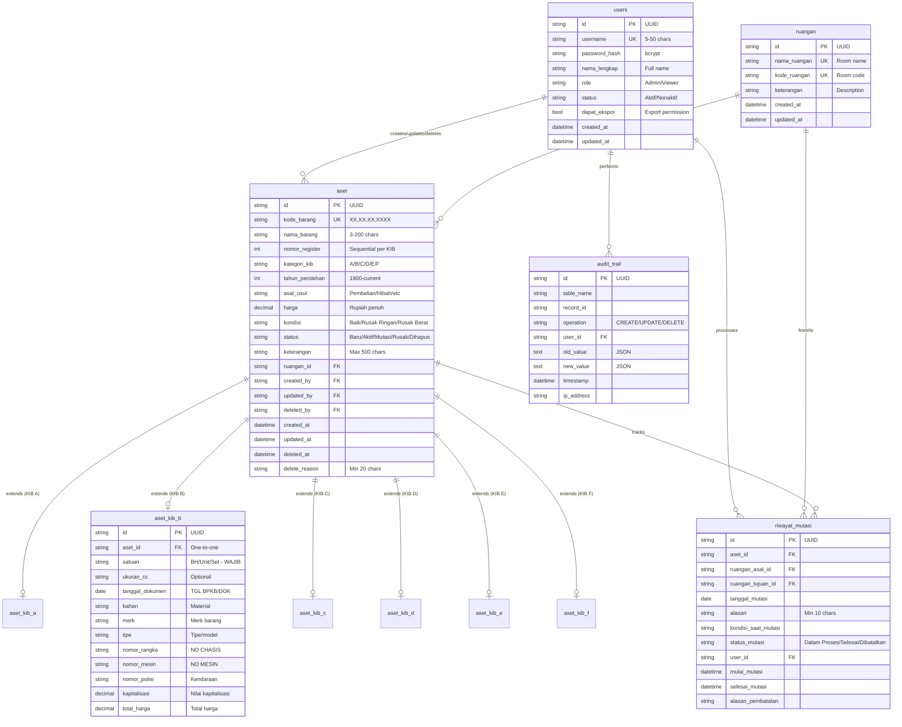

# Dokumen Desain - Integrasi Tauri Python Sidecar SIMANIS62 V2

## Gambaran Umum

Dokumen ini menjelaskan arsitektur dan implementasi untuk mengintegrasikan backend FastAPI Python sebagai sidecar dalam aplikasi desktop Tauri SIMANIS62. Arsitektur ini memungkinkan distribusi aplikasi sebagai single installer yang dapat dijalankan dengan double-click tanpa dependencies tambahan.

**Referensi Dokumentasi:**
- #[[file:docs/data_schema.md]] - Schema database 11 tabel
- #[[file:docs/format_kib_spesifikasi.md]] - Format KIB B 18 kolom BPAD DKI Jakarta
- #[[file:docs/api_contract.md]] - API endpoints lengkap

### Tujuan Desain

1. **Portabilitas** - Aplikasi dapat didistribusikan via flashdisk (< 200MB)
2. **Kemudahan Penggunaan** - User tinggal double-click untuk menjalankan
3. **Offline-First** - Tidak memerlukan koneksi internet
4. **Maintainability** - Kode terstruktur dan mudah di-maintain
5. **Compliance** - Sesuai format BPAD DKI Jakarta untuk KIB B

## Arsitektur

### Diagram Arsitektur Sistem

```
┌─────────────────────────────────────────────────────────────────┐
│                      SIMANIS62 Desktop App                      │
├─────────────────────────────────────────────────────────────────┤
│                                                                 │
│  ┌──────────────────────┐         ┌──────────────────────────┐  │
│  │    Tauri Frontend    │         │    Python Sidecar        │  │
│  │                      │  HTTP   │                          │  │
│  │  ┌────────────────┐  │ Request │  ┌────────────────────┐  │  │
│  │  │  React + Vite  │  │◄───────►│  │  FastAPI Server    │  │  │
│  │  │  TypeScript    │  │ :8000   │  │  Uvicorn Embedded  │  │  │
│  │  └────────────────┘  │         │  └────────────────────┘  │  │
│  │         │            │         │           │              │  │
│  │         ▼            │         │           ▼              │  │
│  │  ┌────────────────┐  │         │  ┌────────────────────┐  │  │
│  │  │ API Service    │  │         │  │  SQLModel ORM      │  │  │
│  │  │ Layer (7 svc)  │  │         │  │  11 Tables         │  │  │
│  │  └────────────────┘  │         │  └────────────────────┘  │  │
│  │                      │         │           │              │  │
│  └──────────────────────┘         │           ▼              │  │
│            │                      │  ┌────────────────────┐  │  │
│            │ IPC                  │  │  SQLite Database   │  │  │
│            ▼                      │  │  simanis62.db      │  │  │
│  ┌──────────────────────┐         │  │  (WAL mode)        │  │  │
│  │    Rust Core         │         │  └────────────────────┘  │  │
│  │    (Tauri Shell)     │─────────┤  Spawn & Manage Process  │  │
│  │    Sidecar Manager   │         │                          │  │
│  └──────────────────────┘         └──────────────────────────┘  │
│                                                                 │
└─────────────────────────────────────────────────────────────────┘
                              │
                              ▼
┌─────────────────────────────────────────────────────────────────┐
│                        File System                              │
├─────────────────────────────────────────────────────────────────┤
│  C:\Program Files\SIMANIS62\          (Aplikasi)                │
│  C:\ProgramData\Simanis62\            (Database & Config)       │
│  C:\ProgramData\Simanis62\backups\    (Backup Database)         │
└─────────────────────────────────────────────────────────────────┘
```

## Komponen dan Antarmuka

### 1. Backend PyInstaller Module

#### 1.1 Modifikasi main.py dengan Lifespan

```python
# backend/app/main.py

import multiprocessing
import sys
import os
from contextlib import asynccontextmanager
from fastapi import FastAPI

def get_base_path() -> str:
    """Mendapatkan base path untuk PyInstaller bundled app."""
    if getattr(sys, 'frozen', False):
        return sys._MEIPASS
    return os.path.dirname(os.path.abspath(__file__))

def get_data_path() -> str:
    """Mendapatkan path untuk data yang writable."""
    if sys.platform == 'win32':
        base = os.environ.get('PROGRAMDATA', 'C:\\ProgramData')
        data_path = os.path.join(base, 'Simanis62')
    else:
        data_path = os.path.expanduser('~/.simanis62')

    os.makedirs(data_path, exist_ok=True)
    return data_path

@asynccontextmanager
async def lifespan(app: FastAPI):
    """Lifespan context manager untuk startup dan shutdown."""
    # Startup
    print(f"[SIMANIS62] Starting backend server...")
    print(f"[SIMANIS62] Data path: {get_data_path()}")
    print(f"[SIMANIS62] Frozen: {getattr(sys, 'frozen', False)}")

    # Initialize database
    from app.core.database import init_db
    await init_db()

    yield

    # Shutdown
    print("[SIMANIS62] Shutting down backend server...")

app = FastAPI(
    title="SIMANIS62 API",
    version="2.0.0",
    lifespan=lifespan
)

# ... routes registration ...

if __name__ == "__main__":
    multiprocessing.freeze_support()
    import uvicorn
    uvicorn.run(
        app,
        host="127.0.0.1",
        port=8000,
        reload=False,
        workers=1
    )
```

#### 1.2 Build Script PyInstaller

```python
# backend/build_sidecar.py

import subprocess
import platform
import sys

def get_target_triple() -> str:
    """Mendapatkan target triple untuk platform saat ini."""
    system = platform.system().lower()
    machine = platform.machine().lower()

    if system == 'windows':
        if machine in ('amd64', 'x86_64'):
            return 'x86_64-pc-windows-msvc'
        return 'i686-pc-windows-msvc'
    elif system == 'darwin':
        if machine == 'arm64':
            return 'aarch64-apple-darwin'
        return 'x86_64-apple-darwin'
    else:
        return 'x86_64-unknown-linux-gnu'

def build_sidecar():
    """Build sidecar executable dengan PyInstaller."""
    target = get_target_triple()
    output_name = f'simanis62-api-{target}'

    cmd = [
        sys.executable, '-m', 'PyInstaller',
        '--onefile',
        '--clean',
        '--name', output_name,
        '--distpath', '../frontend-tauri/src-tauri/bin/api',
        'app/main.py'
    ]

    subprocess.run(cmd, check=True)
    print(f'Sidecar built: {output_name}')

if __name__ == '__main__':
    build_sidecar()
```

### 2. Tauri Sidecar Configuration

#### 2.1 tauri.conf.json

```json
{
  "$schema": "https://schema.tauri.app/config/2",
  "productName": "SIMANIS62",
  "version": "2.0.0",
  "identifier": "com.simanis62.app",
  "build": {
    "beforeDevCommand": "bun run dev",
    "devUrl": "http://localhost:1420",
    "beforeBuildCommand": "bun run build",
    "frontendDist": "../dist"
  },
  "bundle": {
    "active": true,
    "targets": "all",
    "externalBin": ["bin/api/simanis62-api"],
    "icon": ["icons/32x32.png", "icons/128x128.png", "icons/icon.ico"],
    "windows": {
      "nsis": {
        "languages": ["Indonesian"],
        "displayLanguageSelector": false
      }
    }
  },
  "app": {
    "windows": [{
      "title": "SIMANIS62 V2 - Sistem Manajemen Aset Sekolah",
      "width": 1280,
      "height": 800,
      "minWidth": 1024,
      "minHeight": 600,
      "decorations": false,
      "center": true
    }]
  },
  "plugins": {
    "shell": {
      "sidecar": true,
      "scope": [{
        "name": "simanis62-api",
        "sidecar": true
      }]
    }
  }
}
```

#### 2.2 main.rs Sidecar Manager

```rust
// frontend-tauri/src-tauri/src/main.rs

#![cfg_attr(not(debug_assertions), windows_subsystem = "windows")]

use tauri::Manager;
use tauri_plugin_shell::ShellExt;
use tauri_plugin_shell::process::CommandEvent;

#[tauri::command]
async fn check_backend_ready() -> Result<bool, String> {
    match reqwest::get("http://127.0.0.1:8000/health").await {
        Ok(response) => Ok(response.status().is_success()),
        Err(_) => Ok(false),
    }
}

fn main() {
    tauri::Builder::default()
        .plugin(tauri_plugin_shell::init())
        .plugin(tauri_plugin_opener::init())
        .setup(|app| {
            let app_handle = app.handle().clone();

            tauri::async_runtime::spawn(async move {
                let sidecar_command = app_handle
                    .shell()
                    .sidecar("simanis62-api")
                    .expect("Failed to create sidecar command");

                let (mut rx, _child) = sidecar_command
                    .spawn()
                    .expect("Failed to spawn sidecar");

                tauri::async_runtime::spawn(async move {
                    while let Some(event) = rx.recv().await {
                        match event {
                            CommandEvent::Stdout(line) => {
                                println!("[Backend] {}", String::from_utf8_lossy(&line));
                            }
                            CommandEvent::Stderr(line) => {
                                eprintln!("[Backend Error] {}", String::from_utf8_lossy(&line));
                            }
                            _ => {}
                        }
                    }
                });
            });

            Ok(())
        })
        .invoke_handler(tauri::generate_handler![check_backend_ready])
        .run(tauri::generate_context!())
        .expect("Error while running tauri application");
}
```


### 3. Frontend API Service Layer

#### 3.1 Base API Client

```typescript
// frontend-tauri/src/services/api.ts

const API_BASE_URL = 'http://127.0.0.1:8000/api/v1';

interface ApiError {
  message: string;
  code: string;
  details?: Record<string, unknown>;
}

class ApiClient {
  private baseUrl: string;
  private timeout: number;

  constructor(baseUrl: string = API_BASE_URL, timeout: number = 30000) {
    this.baseUrl = baseUrl;
    this.timeout = timeout;
  }

  private async request<T>(endpoint: string, options: RequestInit = {}): Promise<T> {
    const controller = new AbortController();
    const timeoutId = setTimeout(() => controller.abort(), this.timeout);

    try {
      const response = await fetch(`${this.baseUrl}${endpoint}`, {
        ...options,
        signal: controller.signal,
        headers: {
          'Content-Type': 'application/json',
          ...options.headers,
        },
      });

      clearTimeout(timeoutId);

      if (!response.ok) {
        const error: ApiError = await response.json();
        throw new Error(error.message || 'Terjadi kesalahan pada server');
      }

      return response.json();
    } catch (error) {
      clearTimeout(timeoutId);
      if (error instanceof Error) {
        if (error.name === 'AbortError') {
          throw new Error('Request timeout - server tidak merespons');
        }
        throw error;
      }
      throw new Error('Terjadi kesalahan yang tidak diketahui');
    }
  }

  async get<T>(endpoint: string): Promise<T> {
    return this.request<T>(endpoint, { method: 'GET' });
  }

  async post<T>(endpoint: string, data: unknown): Promise<T> {
    return this.request<T>(endpoint, { method: 'POST', body: JSON.stringify(data) });
  }

  async put<T>(endpoint: string, data: unknown): Promise<T> {
    return this.request<T>(endpoint, { method: 'PUT', body: JSON.stringify(data) });
  }

  async delete<T>(endpoint: string): Promise<T> {
    return this.request<T>(endpoint, { method: 'DELETE' });
  }
}

export const apiClient = new ApiClient();
export type { ApiError };
```

#### 3.2 TypeScript Types (Sesuai 11 Tabel Database)

```typescript
// frontend-tauri/src/services/types.ts

// ============ ENUMS ============

export type UserRole = 'Admin' | 'Viewer';
export type UserStatus = 'Aktif' | 'Nonaktif';
export type KondisiAset = 'Baik' | 'Rusak Ringan' | 'Rusak Berat';
export type StatusAset = 'Baru' | 'Aktif' | 'Mutasi' | 'Rusak' | 'Dihapus';
export type KategoriKIB = 'A' | 'B' | 'C' | 'D' | 'E' | 'F';
export type AsalUsul = 'Pembelian' | 'Hibah' | 'Sumbangan' | 'Tukar Menukar' | 'Rampasan' | 'Sitaan' | 'Lainnya';
export type StatusMutasi = 'Dalam Proses' | 'Selesai' | 'Dibatalkan';
export type AuditOperation = 'CREATE' | 'UPDATE' | 'DELETE';

// ============ TABLE 1: users (9 kolom) ============

export interface User {
  id: string;
  username: string;
  nama_lengkap: string;
  role: UserRole;
  status: UserStatus;
  dapat_ekspor: boolean;  // Untuk implementasi Kepala Sekolah
  created_at: string;
  updated_at: string;
}

// ============ TABLE 2: ruangan (6 kolom) ============

export interface Ruangan {
  id: string;
  nama_ruangan: string;
  kode_ruangan: string;
  keterangan: string | null;
  created_at: string;
  updated_at: string;
}

// ============ TABLE 3: aset (19 kolom) - Main Table ============

export interface Aset {
  id: string;
  kode_barang: string;           // Format: XX.XX.XX.XXXX (13 char)
  nama_barang: string;           // 3-200 karakter
  nomor_register: number;        // Auto-increment per kategori KIB
  kategori_kib: KategoriKIB;
  tahun_perolehan: number;       // 1900 - current year
  asal_usul: AsalUsul;
  harga: number;                 // Rupiah penuh, max 999,999,999,999
  kondisi: KondisiAset;
  status: StatusAset;
  keterangan: string | null;     // Max 500 chars
  ruangan_id: string;
  created_by: string;
  updated_by: string | null;
  deleted_by: string | null;
  created_at: string;
  updated_at: string;
  deleted_at: string | null;
  delete_reason: string | null;  // Min 20 chars jika soft-delete

  // Relations (optional, populated by API)
  ruangan?: Ruangan;
  kib_b?: AsetKibB;
}

// ============ TABLE 5: aset_kib_b (12 kolom) - KIB B Extension ============

export interface AsetKibB {
  id: string;
  aset_id: string;
  satuan: string;                // BH/Unit/Set/Buah - WAJIB
  ukuran_cc: string | null;      // Ukuran/CC
  tanggal_dokumen: string | null; // TGL BPKB/DOK (DD/MM/YYYY)
  bahan: string | null;          // Material
  merk: string | null;           // Merk barang
  tipe: string | null;           // Tipe/model
  nomor_rangka: string | null;   // NO CHASIS/RANGKA (kendaraan)
  nomor_mesin: string | null;    // NO MESIN/PABRIK
  nomor_polisi: string | null;   // Untuk kendaraan
  kapitalisasi: number | null;   // Nilai kapitalisasi (Rp.)
  total_harga: number | null;    // Total harga (Rp.)
}

// ============ TABLE 10: riwayat_mutasi (12 kolom) ============

export interface RiwayatMutasi {
  id: string;
  aset_id: string;
  ruangan_asal_id: string;
  ruangan_tujuan_id: string;
  tanggal_mutasi: string;
  alasan: string;                // Min 10 chars
  kondisi_saat_mutasi: KondisiAset;
  status_mutasi: StatusMutasi;
  user_id: string;
  mulai_mutasi: string;
  selesai_mutasi: string | null;
  alasan_pembatalan: string | null;

  // Relations
  aset?: Aset;
  ruangan_asal?: Ruangan;
  ruangan_tujuan?: Ruangan;
  user?: User;
}

// ============ TABLE 11: audit_trail (9 kolom) ============

export interface AuditTrail {
  id: string;
  table_name: string;
  record_id: string;
  operation: AuditOperation;
  user_id: string;
  old_value: string | null;      // JSON string
  new_value: string | null;      // JSON string
  timestamp: string;
  ip_address: string | null;
}

// ============ API RESPONSE TYPES ============

export interface PaginatedResponse<T> {
  items: T[];
  total: number;
  page: number;
  page_size: number;
  total_pages: number;
}

export interface DashboardStats {
  total_aset: number;
  kondisi_baik: number;
  kondisi_rusak_ringan: number;
  kondisi_rusak_berat: number;
  total_nilai: number;
  aset_per_kib: Record<KategoriKIB, number>;
  aset_terbaru: Aset[];
}

// ============ KIB B EXPORT (18 Kolom BPAD DKI Jakarta) ============

export interface KibBExportRow {
  no: number;                    // Kolom A: NO
  kode_barang: string;           // Kolom B: KODE BARANG
  register: number;              // Kolom C: REG
  jenis_barang: string;          // Kolom D: JENIS BARANG
  ukuran: string | null;         // Kolom E: UKURAN
  satuan: string;                // Kolom F: SATUAN
  tanggal_perolehan: string;     // Kolom G: TGL OLEH (DD/MM/YYYY)
  bahan: string | null;          // Kolom H: BAHAN
  merek: string | null;          // Kolom I: MEREK
  tipe: string | null;           // Kolom J: TYPE
  tanggal_dokumen: string | null; // Kolom K: TGL BPKB/DOK
  nomor_rangka: string | null;   // Kolom L: NO CHASIS/RANGKA
  nomor_mesin: string | null;    // Kolom M: NO MESIN/PABRIK
  nomor_polisi: string | null;   // Kolom N: NOMOR POLISI
  asal_usul: string;             // Kolom O: ASAL OLEH
  harga: number;                 // Kolom P: HARGA (Rp.) - Rupiah penuh
  kapitalisasi: number | null;   // Kolom Q: KAPITALISASI (Rp.)
  total: number;                 // Kolom R: TOTAL (Rp.)
}

// ============ REQUEST TYPES ============

export interface CreateAsetRequest {
  kode_barang: string;
  nama_barang: string;
  kategori_kib: KategoriKIB;
  tahun_perolehan: number;
  asal_usul: AsalUsul;
  harga: number;
  kondisi: KondisiAset;
  ruangan_id: string;
  keterangan?: string;
  // KIB B specific fields
  kib_b?: {
    satuan: string;
    ukuran_cc?: string;
    tanggal_dokumen?: string;
    bahan?: string;
    merk?: string;
    tipe?: string;
    nomor_rangka?: string;
    nomor_mesin?: string;
    nomor_polisi?: string;
    kapitalisasi?: number;
  };
}

export interface CreateMutasiRequest {
  aset_id: string;
  ruangan_tujuan_id: string;
  tanggal_mutasi: string;
  alasan: string;
}

export interface DeleteAsetRequest {
  delete_reason: string;  // Min 20 chars
}
```


#### 3.3 Aset Service

```typescript
// frontend-tauri/src/services/aset-service.ts

import { apiClient } from './api';
import type { Aset, PaginatedResponse, CreateAsetRequest, DashboardStats, DeleteAsetRequest } from './types';

export const asetService = {
  async getAll(page = 1, pageSize = 20, kategoriKib?: string): Promise<PaginatedResponse<Aset>> {
    let endpoint = `/aset?page=${page}&page_size=${pageSize}`;
    if (kategoriKib) endpoint += `&kategori_kib=${kategoriKib}`;
    return apiClient.get(endpoint);
  },

  async getById(id: string): Promise<Aset> {
    return apiClient.get(`/aset/${id}`);
  },

  async create(data: CreateAsetRequest): Promise<Aset> {
    return apiClient.post('/aset', data);
  },

  async update(id: string, data: Partial<CreateAsetRequest>): Promise<Aset> {
    return apiClient.put(`/aset/${id}`, data);
  },

  async delete(id: string, data: DeleteAsetRequest): Promise<void> {
    return apiClient.post(`/aset/${id}/delete`, data);
  },

  async search(query: string, page = 1, pageSize = 20): Promise<PaginatedResponse<Aset>> {
    return apiClient.get(`/aset/search?q=${encodeURIComponent(query)}&page=${page}&page_size=${pageSize}`);
  },

  async getStats(): Promise<DashboardStats> {
    return apiClient.get('/aset/stats');
  },
};
```

#### 3.4 KIB B Export Service

```typescript
// frontend-tauri/src/services/kib-service.ts

import { apiClient } from './api';
import type { KibBExportRow } from './types';

export interface KibBExportOptions {
  ruangan_id?: string;
  tahun_perolehan?: number;
  format?: 'xlsx' | 'csv';
}

export const kibService = {
  async getKibBData(options?: KibBExportOptions): Promise<KibBExportRow[]> {
    let endpoint = '/reports/kib/b';
    const params = new URLSearchParams();
    if (options?.ruangan_id) params.append('ruangan_id', options.ruangan_id);
    if (options?.tahun_perolehan) params.append('tahun_perolehan', options.tahun_perolehan.toString());
    if (params.toString()) endpoint += `?${params.toString()}`;
    return apiClient.get(endpoint);
  },

  async exportKibB(options?: KibBExportOptions): Promise<Blob> {
    const format = options?.format || 'xlsx';
    let endpoint = `/reports/export/kib-b?format=${format}`;
    if (options?.ruangan_id) endpoint += `&ruangan_id=${options.ruangan_id}`;
    if (options?.tahun_perolehan) endpoint += `&tahun_perolehan=${options.tahun_perolehan}`;

    const response = await fetch(`http://127.0.0.1:8000/api/v1${endpoint}`, {
      method: 'GET',
      headers: { 'Accept': 'application/octet-stream' },
    });

    if (!response.ok) throw new Error('Gagal mengexport KIB B');
    return response.blob();
  },

  async downloadKibB(options?: KibBExportOptions): Promise<void> {
    const blob = await this.exportKibB(options);
    const url = URL.createObjectURL(blob);
    const a = document.createElement('a');
    a.href = url;
    a.download = `KIB_B_${new Date().toISOString().split('T')[0]}.xlsx`;
    document.body.appendChild(a);
    a.click();
    document.body.removeChild(a);
    URL.revokeObjectURL(url);
  },
};
```

#### 3.5 Mutasi Service

```typescript
// frontend-tauri/src/services/mutasi-service.ts

import { apiClient } from './api';
import type { RiwayatMutasi, PaginatedResponse, CreateMutasiRequest } from './types';

export const mutasiService = {
  async getAll(page = 1, pageSize = 20): Promise<PaginatedResponse<RiwayatMutasi>> {
    return apiClient.get(`/mutasi?page=${page}&page_size=${pageSize}`);
  },

  async getById(id: string): Promise<RiwayatMutasi> {
    return apiClient.get(`/mutasi/${id}`);
  },

  async create(data: CreateMutasiRequest): Promise<RiwayatMutasi> {
    return apiClient.post('/mutasi', data);
  },

  async selesaikan(id: string): Promise<RiwayatMutasi> {
    return apiClient.put(`/mutasi/${id}/selesai`, {});
  },

  async batalkan(id: string, alasan: string): Promise<RiwayatMutasi> {
    return apiClient.put(`/mutasi/${id}/batal`, { alasan_pembatalan: alasan });
  },

  async getByAset(asetId: string): Promise<RiwayatMutasi[]> {
    return apiClient.get(`/mutasi/aset/${asetId}`);
  },
};
```

## Model Data

### Database Schema (11 Tabel)

Referensi lengkap: #[[file:docs/data_schema.md]]



### KIB B 18 Kolom BPAD DKI Jakarta

Referensi lengkap: #[[file:docs/format_kib_spesifikasi.md]]

| No | Kolom | Nama Field (Resmi BPAD) | Database Field | Wajib? |
|----|-------|-------------------------|----------------|--------|
| 1 | A | NO. | (auto-increment) | Ya |
| 2 | B | KODE BARANG | `kode_barang` | Ya |
| 3 | C | REG. | `nomor_register` | Ya |
| 4 | D | JENIS BARANG | `nama_barang` | Ya |
| 5 | E | UKU-RAN | `ukuran_cc` | Tidak |
| 6 | F | SATU-AN | `satuan` | Ya |
| 7 | G | TGL. OLEH | `tahun_perolehan` | Ya |
| 8 | H | BA-HAN | `bahan` | Tidak |
| 9 | I | MEREK | `merk` | Tidak |
| 10 | J | TYPE | `tipe` | Tidak |
| 11 | K | TGL. BPKB/DOK | `tanggal_dokumen` | Tidak |
| 12 | L | NO. CHASIS/RANGKA | `nomor_rangka` | Tidak |
| 13 | M | NO. MESIN/PABRIK | `nomor_mesin` | Tidak |
| 14 | N | NOMOR POLISI | `nomor_polisi` | Tidak |
| 15 | O | ASAL OLEH | `asal_usul` | Ya |
| 16 | P | HARGA (Rp.) | `harga` | Ya |
| 17 | Q | KAPITALISASI (Rp.) | `kapitalisasi` | Tidak |
| 18 | R | TOTAL (Rp.) | `total_harga` | Ya |

**Catatan Penting:**
- Harga dalam **Rupiah penuh** (bukan ribuan)
- Format tanggal: **DD/MM/YYYY**
- Kolom 12-14 khusus untuk kendaraan


## Correctness Properties (Properti Kebenaran)

*Properti kebenaran adalah karakteristik atau perilaku yang harus berlaku untuk semua eksekusi valid dari sistem. Properti ini menjembatani spesifikasi yang dapat dibaca manusia dengan jaminan kebenaran yang dapat diverifikasi mesin.*

### Property 1: Deteksi Mode Frozen

*Untuk setiap* eksekusi aplikasi backend, fungsi `get_frozen_status()` SHALL mengembalikan `True` jika berjalan sebagai PyInstaller executable dan `False` jika berjalan dari source code.

**Validates: Requirements 1.2**

### Property 2: Database Path Writable

*Untuk setiap* operasi write ke database, path yang digunakan SHALL berada di lokasi yang writable oleh user tanpa elevated privileges (C:\ProgramData\Simanis62\ di Windows).

**Validates: Requirements 1.4**

### Property 3: Sidecar Lifecycle Management

*Untuk setiap* siklus hidup aplikasi Tauri:
- Sidecar process SHALL di-spawn saat aplikasi start
- Health check SHALL dipanggil sebelum UI ditampilkan
- Sidecar process SHALL di-terminate saat aplikasi close

**Validates: Requirements 2.2, 2.3, 2.4**

### Property 4: API Error Handling Consistency

*Untuk setiap* API request yang gagal, API_Service_Layer SHALL mengembalikan error object dengan format yang konsisten: `{message: string, code: string, details?: object}`.

**Validates: Requirements 3.2**

### Property 5: Pagination Consistency

*Untuk setiap* request list dengan pagination, response SHALL mengandung:
- `items` dengan jumlah <= `page_size`
- `total` yang akurat
- `page` dan `page_size` yang sesuai request

**Validates: Requirements 4.2**

### Property 6: Search Performance

*Untuk setiap* search query, hasil SHALL dikembalikan dalam waktu < 5 detik dan hasil SHALL mengandung query string dalam salah satu field yang searchable (nama_barang, kode_barang, merk).

**Validates: Requirements 4.3**

### Property 7: Soft Delete Validation

*Untuk setiap* operasi delete aset, `delete_reason` SHALL memiliki panjang >= 20 karakter. Jika kurang, operasi SHALL ditolak dengan error.

**Validates: Requirements 4.6**

### Property 8: KIB B Data Integrity

*Untuk setiap* aset dengan `kategori_kib="B"`:
- Record SHALL ada di tabel `aset`
- Record SHALL ada di tabel `aset_kib_b` dengan `aset_id` yang sama
- Field `satuan` di `aset_kib_b` SHALL tidak null

**Validates: Requirements 8.2, 8.4**

### Property 9: KIB B Export Format Compliance

*Untuk setiap* export KIB B:
- File SHALL memiliki tepat 18 kolom sesuai format BPAD DKI Jakarta
- Harga SHALL dalam Rupiah penuh (bukan ribuan)
- Tanggal SHALL dalam format DD/MM/YYYY
- Hanya aset dengan status "Aktif" yang disertakan

**Validates: Requirements 9.1, 9.2, 9.3, 9.4, 9.5**

### Property 10: Mutasi State Machine

*Untuk setiap* operasi mutasi:
- Mutasi hanya dapat dibuat untuk aset dengan status "Aktif"
- Saat mutasi dibuat, status aset SHALL berubah menjadi "Mutasi"
- Saat mutasi diselesaikan, status aset SHALL kembali ke "Aktif" dan ruangan_id berubah
- Saat mutasi dibatalkan, status aset SHALL kembali ke "Aktif" tanpa perubahan ruangan

**Validates: Requirements 10.1, 10.3, 10.4, 10.5**

### Property 11: Audit Trail Completeness

*Untuk setiap* operasi CREATE, UPDATE, atau DELETE pada tabel aset:
- Record SHALL dibuat di tabel `audit_trail`
- `operation` SHALL sesuai dengan operasi yang dilakukan
- `old_value` SHALL berisi data sebelum perubahan (untuk UPDATE dan DELETE)
- `new_value` SHALL berisi data setelah perubahan (untuk CREATE dan UPDATE)
- `user_id` dan `timestamp` SHALL tidak null

**Validates: Requirements 11.1, 11.2, 11.3, 11.4**

### Property 12: Export Authorization

*Untuk setiap* request export KIB B:
- Jika user memiliki role "Admin", request SHALL diizinkan
- Jika user memiliki role "Viewer" dengan `dapat_ekspor=true`, request SHALL diizinkan
- Jika user memiliki role "Viewer" dengan `dapat_ekspor=false`, request SHALL ditolak dengan error 403

**Validates: Requirements 9.7**

## Error Handling (Penanganan Error)

### Backend Error Handling

```python
# backend/app/core/exceptions.py

class AppException(Exception):
    """Base exception untuk SIMANIS62."""
    def __init__(self, message: str, code: str, status_code: int = 400):
        self.message = message
        self.code = code
        self.status_code = status_code

class NotFoundError(AppException):
    """Resource tidak ditemukan."""
    def __init__(self, resource: str, identifier: str):
        super().__init__(
            message=f"{resource} dengan ID {identifier} tidak ditemukan",
            code="NOT_FOUND",
            status_code=404
        )

class ValidationError(AppException):
    """Error validasi input."""
    def __init__(self, message: str, details: dict = None):
        super().__init__(message=message, code="VALIDATION_ERROR", status_code=400)
        self.details = details

class AuthorizationError(AppException):
    """Tidak punya izin."""
    def __init__(self, message: str = "Anda tidak memiliki izin untuk operasi ini"):
        super().__init__(message=message, code="FORBIDDEN", status_code=403)

class MutasiError(AppException):
    """Error terkait mutasi aset."""
    def __init__(self, message: str):
        super().__init__(message=message, code="MUTASI_ERROR", status_code=400)
```

### Frontend Error Handling

```typescript
// frontend-tauri/src/services/error-handler.ts

export interface AppError {
  message: string;
  code: string;
  userMessage: string;
  recoverable: boolean;
}

const ERROR_MESSAGES: Record<string, string> = {
  'NETWORK_ERROR': 'Tidak dapat terhubung ke server. Pastikan aplikasi berjalan dengan benar.',
  'TIMEOUT_ERROR': 'Server tidak merespons. Silakan coba lagi.',
  'NOT_FOUND': 'Data tidak ditemukan.',
  'VALIDATION_ERROR': 'Data yang dimasukkan tidak valid.',
  'FORBIDDEN': 'Anda tidak memiliki izin untuk operasi ini.',
  'MUTASI_ERROR': 'Operasi mutasi tidak dapat dilakukan.',
};

export function handleApiError(error: unknown): AppError {
  if (error instanceof Error) {
    const code = extractErrorCode(error.message);
    return {
      message: error.message,
      code,
      userMessage: ERROR_MESSAGES[code] || error.message,
      recoverable: code !== 'FORBIDDEN',
    };
  }

  return {
    message: String(error),
    code: 'UNKNOWN_ERROR',
    userMessage: 'Terjadi kesalahan yang tidak diketahui.',
    recoverable: false,
  };
}
```

## Testing Strategy (Strategi Pengujian)

### Pendekatan Dual Testing

Pengujian menggunakan kombinasi:
1. **Unit Tests** - Untuk fungsi dan komponen individual
2. **Property-Based Tests** - Untuk memverifikasi properti universal (menggunakan Hypothesis untuk Python, fast-check untuk TypeScript)
3. **Integration Tests** - Untuk flow end-to-end
4. **E2E Tests dengan Playwright** - Untuk UI testing

### Property-Based Testing Configuration

**Backend (Python - Hypothesis):**
- Minimum 100 iterations per property test
- Setiap test harus reference property dari design document

**Frontend (TypeScript - fast-check):**
- Minimum 100 iterations per property test
- Setiap test harus reference property dari design document

### Unit Tests

#### Backend (pytest)

```python
# backend/tests/test_frozen_detection.py

import pytest
from app.core.config import get_frozen_status, get_data_directory

def test_frozen_status_in_development():
    """Test deteksi mode development."""
    assert get_frozen_status() == False

def test_data_directory_exists():
    """Test direktori data dapat dibuat."""
    data_dir = get_data_directory()
    assert data_dir.exists()
    assert data_dir.is_dir()

def test_data_directory_writable():
    """Test direktori data writable."""
    data_dir = get_data_directory()
    test_file = data_dir / 'test_write.tmp'
    test_file.write_text('test')
    assert test_file.exists()
    test_file.unlink()
```

### Property-Based Tests

#### Backend (Hypothesis)

```python
# backend/tests/test_properties.py

from hypothesis import given, strategies as st
import pytest

# Property 7: Soft Delete Validation
@given(reason=st.text(min_size=0, max_size=19))
def test_delete_reason_too_short_rejected(reason: str):
    """
    Property 7: Soft Delete Validation
    Untuk setiap delete_reason dengan panjang < 20, operasi SHALL ditolak.

    **Validates: Requirements 4.6**
    """
    with pytest.raises(ValidationError):
        validate_delete_reason(reason)

@given(reason=st.text(min_size=20, max_size=500))
def test_delete_reason_valid_accepted(reason: str):
    """
    Property 7: Soft Delete Validation
    Untuk setiap delete_reason dengan panjang >= 20, operasi SHALL diterima.

    **Validates: Requirements 4.6**
    """
    assert validate_delete_reason(reason) == True

# Property 8: KIB B Data Integrity
@given(
    kode_barang=st.from_regex(r'[0-9]{2}\.[0-9]{2}\.[0-9]{2}\.[0-9]{4}'),
    nama_barang=st.text(min_size=3, max_size=200),
    satuan=st.sampled_from(['BH', 'Unit', 'Set', 'Buah'])
)
def test_kib_b_creates_both_records(kode_barang, nama_barang, satuan):
    """
    Property 8: KIB B Data Integrity
    Untuk setiap aset KIB B, record harus ada di tabel aset DAN aset_kib_b.

    **Validates: Requirements 8.2, 8.4**
    """
    aset = create_aset_kib_b(kode_barang, nama_barang, satuan)

    assert aset is not None
    assert aset.kategori_kib == 'B'

    kib_b = get_kib_b_by_aset_id(aset.id)
    assert kib_b is not None
    assert kib_b.satuan == satuan
```

### E2E Tests dengan Playwright

```typescript
// frontend-tauri/tests/e2e/kib-export.spec.ts

import { test, expect } from '@playwright/test';

test.describe('KIB B Export', () => {
  test('should export KIB B with 18 columns', async ({ page }) => {
    // Login as Admin
    await page.goto('http://localhost:1420/login');
    await page.fill('[data-testid="username"]', 'admin');
    await page.fill('[data-testid="password"]', 'password');
    await page.click('[data-testid="login-button"]');

    // Navigate to export
    await page.goto('http://localhost:1420/reports/kib-b');

    // Click export button
    const downloadPromise = page.waitForEvent('download');
    await page.click('[data-testid="export-kib-b"]');
    const download = await downloadPromise;

    // Verify file downloaded
    expect(download.suggestedFilename()).toMatch(/KIB_B_.*\.xlsx/);
  });

  test('should reject export for Viewer without dapat_ekspor', async ({ page }) => {
    // Login as Viewer without export permission
    await page.goto('http://localhost:1420/login');
    await page.fill('[data-testid="username"]', 'viewer');
    await page.fill('[data-testid="password"]', 'password');
    await page.click('[data-testid="login-button"]');

    // Navigate to export
    await page.goto('http://localhost:1420/reports/kib-b');

    // Export button should be disabled or show error
    const exportButton = page.locator('[data-testid="export-kib-b"]');
    await expect(exportButton).toBeDisabled();
  });
});
```

## Catatan Implementasi

### Naming Convention (WAJIB DIIKUTI)

| Konteks | Konvensi | Bahasa | Contoh |
|---------|----------|--------|--------|
| Database fields | snake_case | Bahasa Indonesia | `nomor_register`, `dapat_ekspor` |
| Class names | PascalCase | English | `AssetService`, `MutationRepository` |
| Function names (Python) | snake_case | English | `get_asset_by_id()` |
| API endpoints | kebab-case | English | `/api/v1/aset`, `/api/v1/mutasi` |
| Enum values | TitleCase | Bahasa Indonesia | `"Aktif"`, `"Rusak Ringan"` |
| UI messages | - | Bahasa Indonesia | `"Aset berhasil disimpan"` |

### Performance Targets

| Operasi | Target |
|---------|--------|
| Search aset | < 5 detik |
| Generate KIB B | < 10 detik |
| Export Excel | < 15 detik |
| Login | < 2 detik |
| Installer size | < 200 MB |
