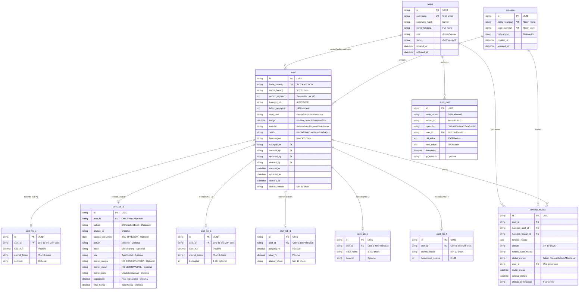

# Database Schema Simanis62 V2

| Versi | Tanggal | Penulis | Keterangan |
|-------|---------|---------|------------|
| 1.0 | 5 Januari 2026 | Architecture Engineer | Schema awal berdasarkan analisis komprehensif dokumentasi |
| 2.0 | 11 Januari 2026 | Kiro AI | Update tabel aset_kib_b sesuai format BPAD DKI Jakarta (terverifikasi) |
| **2.1** | **11 Januari 2026** | **Kiro AI** | **KOREKSI: Format KIB B dikoreksi menjadi 18 kolom (bukan 20). Field `diperoleh_oleh` dan `penerbit_dokumen` dihapus karena tidak ada di format resmi** |

---

## 1. Pendahuluan

### 1.1 Tujuan Dokumen

Dokumen ini mendefinisikan skema database lengkap untuk sistem Simanis62 V2 berdasarkan analisis mendalam dari 5 dokumen arsitektur:
1. Tujuan Bisnis, Peta Pemangku Kepentingan, Kendala & Asumsi
2. Pemilik Kebenaran, Masalah Inti, Konteks & Batasan
3. User Stories (19 stories dengan acceptance criteria)
4. Alur Kerja & Aturan Main (business rules lengkap)
5. Tech Stack (SQLite + SQLModel)

Dokumen ini mencakup:
- **ERD Diagram** dengan 11 tabel dan relasi lengkap
- **SQLModel Table Definitions** dengan type hints dan validasi
- **Field Descriptions** untuk setiap kolom
- **Constraints & Indexes** untuk data integrity dan performa
- **Migration Notes** untuk implementasi

### 1.2 Teknologi Stack

| Komponen | Teknologi | Versi | Keterangan |
|----------|-----------|-------|------------|
| Database | SQLite | 3.x | Dengan WAL mode untuk concurrency |
| ORM | SQLModel | Latest | SQLAlchemy + Pydantic integration |
| Python | Python | 3.12 | Backend runtime |
| Backend | FastAPI | Latest | REST API framework |

### 1.3 Prinsip Desain Database

| Prinsip | Implementasi | Alasan |
|---------|--------------|--------|
| **Single Table Inheritance** | Main `aset` table + 6 extension tables (aset_kib_a to aset_kib_f) | Menghindari sparse columns, memudahkan query per kategori KIB |
| **Soft Delete** | Status "Dihapus" + deleted_at timestamp | Audit trail permanen, data tidak hilang |
| **UUID Primary Keys** | VARCHAR(36) in SQLite | Distributed system ready, no collision |
| **Auto-increment Nomor Register** | Application-level logic per kategori_kib | Sequential per KIB category (A, B, C, D, E, F) |
| **Audit Trail** | Separate audit_trail table | Complete logging of all CRUD operations |
| **Referential Integrity** | Foreign keys dengan ON DELETE RESTRICT | Prevent orphaned records |

### 1.4 Fitur yang Sengaja Tidak Diimplementasi (Excluded Features)

Schema ini **SENGAJA TIDAK** mencakup fitur-fitur berikut untuk menjaga kesederhanaan dan fokus pada core functionality:

#### 1.4.1 Integrasi SIMBADA
**Alasan:** Memerlukan API pemerintah yang tidak tersedia
**Future Expansion:** Dapat ditambahkan tabel `simbada_sync` jika API tersedia
```sql
-- FUTURE: simbada_sync table
-- CREATE TABLE simbada_sync (
--     id VARCHAR(36) PRIMARY KEY,
--     aset_id VARCHAR(36) REFERENCES aset(id),
--     simbada_id VARCHAR(50),
--     last_sync TIMESTAMP,
--     sync_status VARCHAR(20)
-- );
```

#### 1.4.2 Perhitungan Depresiasi/Penyusutan
**Alasan:** Kompleksitas tinggi, bukan kebutuhan inti sekolah
**Future Expansion:** Dapat ditambahkan tabel `depreciation_schedules`
```sql
-- FUTURE: depreciation_schedules table
-- CREATE TABLE depreciation_schedules (
--     id VARCHAR(36) PRIMARY KEY,
--     aset_id VARCHAR(36) REFERENCES aset(id),
--     method VARCHAR(50), -- Straight-line, Declining balance
--     useful_life_years INTEGER,
--     salvage_value BIGINT,
--     annual_depreciation BIGINT,
--     accumulated_depreciation BIGINT
-- );
```

#### 1.4.3 Workflow Persetujuan Penghapusan Aset
**Alasan:** Proses formal melibatkan banyak pihak di luar sistem
**Future Expansion:** Dapat ditambahkan tabel `approval_workflows`
```sql
-- FUTURE: approval_workflows table
-- CREATE TABLE approval_workflows (
--     id VARCHAR(36) PRIMARY KEY,
--     aset_id VARCHAR(36) REFERENCES aset(id),
--     workflow_type VARCHAR(50), -- Delete, Transfer, etc.
--     status VARCHAR(20), -- Pending, Approved, Rejected
--     requested_by VARCHAR(36) REFERENCES users(id),
--     approved_by VARCHAR(36) REFERENCES users(id),
--     requested_at TIMESTAMP,
--     approved_at TIMESTAMP,
--     notes TEXT
-- );
```

#### 1.4.4 Pemeliharaan dan Perbaikan Aset
**Alasan:** Fitur tambahan yang dapat ditambahkan kemudian
**Future Expansion:** Dapat ditambahkan tabel `maintenance_logs`
```sql
-- FUTURE: maintenance_logs table
-- CREATE TABLE maintenance_logs (
--     id VARCHAR(36) PRIMARY KEY,
--     aset_id VARCHAR(36) REFERENCES aset(id),
--     maintenance_type VARCHAR(50), -- Preventive, Corrective
--     description TEXT,
--     cost BIGINT,
--     performed_by VARCHAR(200),
--     performed_at TIMESTAMP,
--     next_maintenance_date DATE
-- );
```

#### 1.4.5 Peminjaman Aset
**Alasan:** Tidak semua sekolah memerlukan fitur ini
**Future Expansion:** Dapat ditambahkan tabel `asset_loans`
```sql
-- FUTURE: asset_loans table
-- CREATE TABLE asset_loans (
--     id VARCHAR(36) PRIMARY KEY,
--     aset_id VARCHAR(36) REFERENCES aset(id),
--     borrower_name VARCHAR(200),
--     borrower_contact VARCHAR(100),
--     loan_date DATE,
--     return_date DATE,
--     actual_return_date DATE,
--     status VARCHAR(20), -- Active, Returned, Overdue
--     notes TEXT
-- );
```

#### 1.4.6 Notifikasi Otomatis
**Alasan:** Memerlukan infrastruktur email/SMS yang tidak selalu tersedia
**Future Expansion:** Dapat ditambahkan tabel `notifications`
```sql
-- FUTURE: notifications table
-- CREATE TABLE notifications (
--     id VARCHAR(36) PRIMARY KEY,
--     user_id VARCHAR(36) REFERENCES users(id),
--     notification_type VARCHAR(50), -- Asset_Damaged, Loan_Overdue, etc.
--     title VARCHAR(200),
--     message TEXT,
--     is_read BOOLEAN DEFAULT 0,
--     created_at TIMESTAMP
-- );
```

#### 1.4.7 Dashboard dan Visualisasi Data
**Alasan:** Fitur tambahan yang dapat ditambahkan kemudian
**Future Expansion:** Frontend feature, tidak memerlukan perubahan schema
```sql
-- FUTURE: No schema changes needed
-- Dashboard akan query data dari tabel existing:
-- - Total aset per KIB category
-- - Total nilai aset
-- - Kondisi aset (Baik vs Rusak)
-- - Trend mutasi aset
```

**Catatan Penting:**
- Semua fitur di atas dapat ditambahkan di iterasi selanjutnya tanpa breaking changes
- Schema saat ini sudah cukup untuk memenuhi kebutuhan inti (KIB reporting)
- Penambahan fitur harus melalui proses analisis kebutuhan yang sama ketatnya

---

## 2. Database Overview

### 2.1 Tabel Summary

| No | Tabel | Deskripsi | Jumlah Kolom | Primary Key |
|----|-------|-----------|--------------|-------------|
| 1 | users | User authentication & authorization | 9 | id (UUID) |
| 2 | ruangan | Room/location management | 6 | id (UUID) |
| 3 | aset | Main asset table (all KIB types) | 19 | id (UUID) |
| 4 | aset_kib_a | KIB A (Tanah) specific fields | 4 | id (UUID) |
| 5 | aset_kib_b | KIB B (Peralatan & Mesin) specific fields - Format BPAD DKI Jakarta 18 kolom | 12 | id (UUID) |
| 6 | aset_kib_c | KIB C (Gedung & Bangunan) specific fields | 4 | id (UUID) |
| 7 | aset_kib_d | KIB D (Jalan, Irigasi, Jaringan) specific fields | 4 | id (UUID) |
| 8 | aset_kib_e | KIB E (Aset Tetap Lainnya) specific fields | 3 | id (UUID) |
| 9 | aset_kib_f | KIB F (Konstruksi dalam Pengerjaan) specific fields | 3 | id (UUID) |
| 10 | riwayat_mutasi | Asset movement history | 12 | id (UUID) |
| 11 | audit_trail | Complete audit log for all operations | 9 | id (UUID) |

**Total: 11 tables**

### 2.2 Relasi Antar Tabel

```text
users (1) ----< (N) aset [created_by, updated_by, deleted_by]
users (1) ----< (N) riwayat_mutasi [user_id]
users (1) ----< (N) audit_trail [user_id]

ruangan (1) ----< (N) aset [ruangan_id]
ruangan (1) ----< (N) riwayat_mutasi [ruangan_asal_id, ruangan_tujuan_id]

aset (1) ----< (0..1) aset_kib_a [aset_id]
aset (1) ----< (0..1) aset_kib_b [aset_id]
aset (1) ----< (0..1) aset_kib_c [aset_id]
aset (1) ----< (0..1) aset_kib_d [aset_id]
aset (1) ----< (0..1) aset_kib_e [aset_id]
aset (1) ----< (0..1) aset_kib_f [aset_id]
aset (1) ----< (N) riwayat_mutasi [aset_id]
```

---

## 3. Entity Relationship Diagram (ERD)



---

## 4. SQLModel Table Definitions

### 4.1 Table: users

**Deskripsi:** User authentication dan authorization dengan role-based access control.

**SQLModel Definition:**

```python
from sqlmodel import SQLModel, Field, Relationship
from typing import Optional, List
from datetime import datetime
from enum import Enum
import uuid

class UserRole(str, Enum):
    ADMIN = "Admin"
    VIEWER = "Viewer"

class UserStatus(str, Enum):
    AKTIF = "Aktif"
    NONAKTIF = "Nonaktif"

class User(SQLModel, table=True):
    __tablename__ = "users"

    # Primary Key
    id: str = Field(
        default_factory=lambda: str(uuid.uuid4()),
        primary_key=True,
        max_length=36,
        description="UUID primary key"
    )

    # Authentication
    username: str = Field(
        unique=True,
        min_length=5,
        max_length=50,
        index=True,
        description="Unique username for login"
    )
    password_hash: str = Field(
        max_length=255,
        description="Bcrypt hashed password"
    )

    # User Info
    nama_lengkap: str = Field(
        max_length=200,
        description="Full name of user"
    )

    # Authorization
    role: UserRole = Field(
        default=UserRole.VIEWER,
        description="User role: Admin or Viewer"
    )
    status: UserStatus = Field(
        default=UserStatus.AKTIF,
        description="User status: Aktif or Nonaktif"
    )
    dapat_ekspor: bool = Field(
        default=False,
        description="Export permission for Viewer role (enables Kepala Sekolah functionality)"
    )

    # Timestamps
    created_at: datetime = Field(
        default_factory=datetime.utcnow,
        description="User creation timestamp"
    )
    updated_at: datetime = Field(
        default_factory=datetime.utcnow,
        description="Last update timestamp"
    )

    # Relationships
    aset_created: List["Aset"] = Relationship(
        back_populates="creator",
        sa_relationship_kwargs={"foreign_keys": "Aset.created_by"}
    )
    aset_updated: List["Aset"] = Relationship(
        back_populates="updater",
        sa_relationship_kwargs={"foreign_keys": "Aset.updated_by"}
    )
    aset_deleted: List["Aset"] = Relationship(
        back_populates="deleter",
        sa_relationship_kwargs={"foreign_keys": "Aset.deleted_by"}
    )
    riwayat_mutasi: List["RiwayatMutasi"] = Relationship(back_populates="user")
    audit_trail: List["AuditTrail"] = Relationship(back_populates="user")
```

**Field Descriptions:**

| Field | Type | Constraint | Description |
|-------|------|------------|-------------|
| id | VARCHAR(36) | PRIMARY KEY | UUID generated automatically |
| username | VARCHAR(50) | UNIQUE, NOT NULL | Login username (5-50 chars) |
| password_hash | VARCHAR(255) | NOT NULL | Bcrypt hashed password |
| nama_lengkap | VARCHAR(200) | NOT NULL | Full name of user |
| role | VARCHAR(10) | NOT NULL | Admin or Viewer |
| status | VARCHAR(10) | NOT NULL | Aktif or Nonaktif |
| dapat_ekspor | BOOLEAN | NOT NULL, DEFAULT FALSE | Export permission for Viewer role |
| created_at | DATETIME | NOT NULL | User creation timestamp |
| updated_at | DATETIME | NOT NULL | Last update timestamp |

**Indexes:**
- PRIMARY KEY on `id`
- UNIQUE INDEX on `username`
- INDEX on `role` (for filtering by role)
- INDEX on `status` (for filtering active users)

**Business Rules:**
- Username must be unique (5-50 characters)
- Password must be hashed using bcrypt (min 8 chars, letters + numbers)
- Only Admin can create/update/delete users
- Admin cannot delete themselves
- Soft delete via status = "Nonaktif"

**Role Implementation Note (v2.0):**
- System implements **2 technical roles**: Admin and Viewer
- **Kepala Sekolah** business role uses Viewer role with additional `dapat_ekspor` flag
- This design simplifies v2.0 while supporting 3 business roles (Admin, Viewer/Guru, Kepala Sekolah)
- Future versions may add dedicated Kepala Sekolah role if needed

**Field `dapat_ekspor` (WAJIB untuk implementasi Kepala Sekolah):**
```python
dapat_ekspor: bool = Field(
    default=False,
    description="Export permission for Viewer role (enables Kepala Sekolah functionality)"
)
```

> **Catatan Naming Convention:** Field database menggunakan snake_case Bahasa Indonesia (`dapat_ekspor`) sesuai standar proyek di AGENTS.md.

---

### 4.2 Table: ruangan

**Deskripsi:** Room/location management untuk tracking lokasi fisik aset.

**SQLModel Definition:**

```python
class Ruangan(SQLModel, table=True):
    __tablename__ = "ruangan"

    # Primary Key
    id: str = Field(
        default_factory=lambda: str(uuid.uuid4()),
        primary_key=True,
        max_length=36,
        description="UUID primary key"
    )

    # Room Info
    nama_ruangan: str = Field(
        unique=True,
        max_length=200,
        index=True,
        description="Room name (e.g., Lab Komputer, Ruang Guru)"
    )
    kode_ruangan: str = Field(
        unique=True,
        max_length=50,
        index=True,
        description="Room code (e.g., LAB-01, RG-02)"
    )
    keterangan: Optional[str] = Field(
        default=None,
        max_length=500,
        description="Room description/notes"
    )

    # Timestamps
    created_at: datetime = Field(
        default_factory=datetime.utcnow,
        description="Room creation timestamp"
    )
    updated_at: datetime = Field(
        default_factory=datetime.utcnow,
        description="Last update timestamp"
    )

    # Relationships
    aset: List["Aset"] = Relationship(back_populates="ruangan")
    riwayat_mutasi_asal: List["RiwayatMutasi"] = Relationship(
        back_populates="ruangan_asal",
        sa_relationship_kwargs={"foreign_keys": "RiwayatMutasi.ruangan_asal_id"}
    )
    riwayat_mutasi_tujuan: List["RiwayatMutasi"] = Relationship(
        back_populates="ruangan_tujuan",
        sa_relationship_kwargs={"foreign_keys": "RiwayatMutasi.ruangan_tujuan_id"}
    )
```

**Field Descriptions:**

| Field | Type | Constraint | Description |
|-------|------|------------|-------------|
| id | VARCHAR(36) | PRIMARY KEY | UUID generated automatically |
| nama_ruangan | VARCHAR(200) | UNIQUE, NOT NULL | Room name (e.g., Lab Komputer) |
| kode_ruangan | VARCHAR(50) | UNIQUE, NOT NULL | Room code (e.g., LAB-01) |
| keterangan | VARCHAR(500) | NULL | Room description/notes |
| created_at | DATETIME | NOT NULL | Room creation timestamp |
| updated_at | DATETIME | NOT NULL | Last update timestamp |

**Indexes:**
- PRIMARY KEY on `id`
- UNIQUE INDEX on `nama_ruangan`
- UNIQUE INDEX on `kode_ruangan`

**Business Rules:**
- Nama ruangan must be unique
- Kode ruangan must be unique
- Cannot delete ruangan if it contains assets (referential integrity)
- If ruangan deleted, assets moved to "Ruangan Tidak Diketahui"

---

### 4.3 Table: aset (Main Asset Table)

**Deskripsi:** Main asset table containing all common fields across KIB A-F categories.

**SQLModel Definition:**

```python
class KategoriKIB(str, Enum):
    A = "A"  # Tanah
    B = "B"  # Peralatan dan Mesin
    C = "C"  # Gedung dan Bangunan
    D = "D"  # Jalan, Irigasi, dan Jaringan
    E = "E"  # Aset Tetap Lainnya
    F = "F"  # Konstruksi dalam Pengerjaan

class AsalUsul(str, Enum):
    PEMBELIAN = "Pembelian"
    HIBAH = "Hibah"
    BANTUAN = "Bantuan"

class Kondisi(str, Enum):
    BAIK = "Baik"
    RUSAK_RINGAN = "Rusak Ringan"
    RUSAK_BERAT = "Rusak Berat"

class StatusAset(str, Enum):
    BARU = "Baru"
    AKTIF = "Aktif"
    MUTASI = "Mutasi"
    RUSAK = "Rusak"
    DIHAPUS = "Dihapus"

class Aset(SQLModel, table=True):
    __tablename__ = "aset"

    # Primary Key
    id: str = Field(
        default_factory=lambda: str(uuid.uuid4()),
        primary_key=True,
        max_length=36,
        description="UUID primary key"
    )

    # Asset Identification
    kode_barang: str = Field(
        unique=True,
        max_length=20,
        regex=r"^\d{2}\.\d{2}\.\d{2}\.\d{4}$",
        index=True,
        description="Unique asset code (format: XX.XX.XX.XXXX)"
    )
    nama_barang: str = Field(
        min_length=3,
        max_length=200,
        index=True,
        description="Asset name (3-200 characters)"
    )
    nomor_register: int = Field(
        ge=1,
        index=True,
        description="Sequential register number per KIB category"
    )
    kategori_kib: KategoriKIB = Field(
        index=True,
        description="KIB category: A/B/C/D/E/F"
    )

    # Asset Details
    tahun_perolehan: int = Field(
        ge=1900,
        le=2100,
        description="Year of acquisition (1900-current year)"
    )
    tanggal_perolehan: Optional[date] = Field(
        default=None,
        description="Full acquisition date - format DD/MM/YYYY for KIB reports"
    )
    asal_usul: AsalUsul = Field(
        description="Origin: Pembelian/Hibah/Bantuan"
    )
    harga: int = Field(
        gt=0,
        le=999999999999,
        description="Asset price (positive, max 999,999,999,999)"
    )
    kondisi: Kondisi = Field(
        description="Condition: Baik/Rusak Ringan/Rusak Berat"
    )
    status: StatusAset = Field(
        default=StatusAset.BARU,
        index=True,
        description="Status: Baru/Aktif/Mutasi/Rusak/Dihapus"
    )
    keterangan: Optional[str] = Field(
        default=None,
        max_length=500,
        description="Additional notes (max 500 chars)"
    )

    # Foreign Keys
    ruangan_id: str = Field(
        foreign_key="ruangan.id",
        index=True,
        description="Current room location"
    )
    created_by: str = Field(
        foreign_key="users.id",
        description="User who created this asset"
    )
    updated_by: Optional[str] = Field(
        default=None,
        foreign_key="users.id",
        description="User who last updated this asset"
    )
    deleted_by: Optional[str] = Field(
        default=None,
        foreign_key="users.id",
        description="User who deleted this asset"
    )

    # Timestamps
    created_at: datetime = Field(
        default_factory=datetime.utcnow,
        description="Asset creation timestamp"
    )
    updated_at: datetime = Field(
        default_factory=datetime.utcnow,
        description="Last update timestamp"
    )
    deleted_at: Optional[datetime] = Field(
        default=None,
        description="Soft delete timestamp"
    )

    # Soft Delete
    delete_reason: Optional[str] = Field(
        default=None,
        min_length=20,
        max_length=500,
        description="Reason for deletion (min 20 chars)"
    )

    # Relationships
    ruangan: "Ruangan" = Relationship(back_populates="aset")
    creator: "User" = Relationship(
        back_populates="aset_created",
        sa_relationship_kwargs={"foreign_keys": "[Aset.created_by]"}
    )
    updater: Optional["User"] = Relationship(
        back_populates="aset_updated",
        sa_relationship_kwargs={"foreign_keys": "[Aset.updated_by]"}
    )
    deleter: Optional["User"] = Relationship(
        back_populates="aset_deleted",
        sa_relationship_kwargs={"foreign_keys": "[Aset.deleted_by]"}
    )

    # KIB Extensions (One-to-One)
    kib_a: Optional["AsetKIBA"] = Relationship(back_populates="aset")
    kib_b: Optional["AsetKIBB"] = Relationship(back_populates="aset")
    kib_c: Optional["AsetKIBC"] = Relationship(back_populates="aset")
    kib_d: Optional["AsetKIBD"] = Relationship(back_populates="aset")
    kib_e: Optional["AsetKIBE"] = Relationship(back_populates="aset")
    kib_f: Optional["AsetKIBF"] = Relationship(back_populates="aset")

    # Mutation History
    riwayat_mutasi: List["RiwayatMutasi"] = Relationship(back_populates="aset")
```

**Field Descriptions:**

| Field | Type | Constraint | Description |
|-------|------|------------|-------------|
| id | VARCHAR(36) | PRIMARY KEY | UUID generated automatically |
| kode_barang | VARCHAR(20) | UNIQUE, NOT NULL | Format: XX.XX.XX.XXXX |
| nama_barang | VARCHAR(200) | NOT NULL | Asset name (3-200 chars) |
| nomor_register | INTEGER | NOT NULL | Sequential per KIB category |
| kategori_kib | VARCHAR(1) | NOT NULL | A/B/C/D/E/F |
| tahun_perolehan | INTEGER | NOT NULL | 1900-current year |
| tanggal_perolehan | DATE | NULL | Full date for KIB reports (DD/MM/YYYY) |
| asal_usul | VARCHAR(20) | NOT NULL | Pembelian/Hibah/Bantuan |
| harga | BIGINT | NOT NULL | Positive, max 999,999,999,999 |
| kondisi | VARCHAR(20) | NOT NULL | Baik/Rusak Ringan/Rusak Berat |
| status | VARCHAR(10) | NOT NULL | Baru/Aktif/Mutasi/Rusak/Dihapus |
| keterangan | VARCHAR(500) | NULL | Additional notes |
| ruangan_id | VARCHAR(36) | FK, NOT NULL | Current room location |
| created_by | VARCHAR(36) | FK, NOT NULL | Creator user ID |
| updated_by | VARCHAR(36) | FK, NULL | Last updater user ID |
| deleted_by | VARCHAR(36) | FK, NULL | Deleter user ID |
| created_at | DATETIME | NOT NULL | Creation timestamp |
| updated_at | DATETIME | NOT NULL | Last update timestamp |
| deleted_at | DATETIME | NULL | Soft delete timestamp |
| delete_reason | VARCHAR(500) | NULL | Deletion reason (min 20 chars) |

**Indexes:**
- PRIMARY KEY on `id`
- UNIQUE INDEX on `kode_barang`
- INDEX on `nama_barang` (for search)
- INDEX on `nomor_register`
- INDEX on `kategori_kib` (for KIB reports)
- INDEX on `status` (for filtering)
- INDEX on `ruangan_id` (for KIR reports)
- COMPOSITE INDEX on `(kategori_kib, nomor_register)` for uniqueness per category

**Constraints:**
- CHECK: `tahun_perolehan >= 1900 AND tahun_perolehan <= YEAR(CURRENT_DATE)`
- CHECK: `harga > 0`
- CHECK: `kode_barang REGEXP '^[0-9]{2}\.[0-9]{2}\.[0-9]{2}\.[0-9]{4}$'`
- FOREIGN KEY: `ruangan_id` REFERENCES `ruangan(id)` ON DELETE RESTRICT
- FOREIGN KEY: `created_by` REFERENCES `users(id)` ON DELETE RESTRICT
- FOREIGN KEY: `updated_by` REFERENCES `users(id)` ON DELETE RESTRICT
- FOREIGN KEY: `deleted_by` REFERENCES `users(id)` ON DELETE RESTRICT

**Business Rules:**
- Kode barang must be unique across all assets
- Nomor register auto-increments per kategori_kib (application-level)
- Status "Mutasi" means asset is being moved (temporary state)
- Status "Dihapus" is soft delete (data not actually deleted)
- Kondisi "Rusak Ringan" or "Rusak Berat" automatically sets status to "Rusak"
- Delete reason required if status = "Dihapus" (min 20 characters)
- Cannot delete asset if status = "Mutasi"

---

### 4.4 Table: aset_kib_a (KIB A - Tanah)

**Deskripsi:** Extension table untuk KIB A (Tanah) dengan field-specific untuk kategori tanah.

**SQLModel Definition:**

```python
class AsetKIBA(SQLModel, table=True):
    __tablename__ = "aset_kib_a"

    # Primary Key
    id: str = Field(
        default_factory=lambda: str(uuid.uuid4()),
        primary_key=True,
        max_length=36,
        description="UUID primary key"
    )

    # Foreign Key (One-to-One with aset)
    aset_id: str = Field(
        foreign_key="aset.id",
        unique=True,
        index=True,
        description="Reference to main aset table"
    )

    # KIB A Specific Fields
    luas_m2: float = Field(
        gt=0,
        description="Land area in square meters (positive)"
    )
    alamat_lokasi: str = Field(
        min_length=10,
        max_length=500,
        description="Land address/location (min 10 chars)"
    )
    sertifikat: Optional[str] = Field(
        default=None,
        max_length=100,
        description="Certificate number (optional)"
    )

    # Relationship
    aset: "Aset" = Relationship(back_populates="kib_a")
```

**Field Descriptions:**

| Field | Type | Constraint | Description |
|-------|------|------------|-------------|
| id | VARCHAR(36) | PRIMARY KEY | UUID generated automatically |
| aset_id | VARCHAR(36) | FK, UNIQUE, NOT NULL | One-to-one with aset table |
| luas_m2 | DECIMAL(15,2) | NOT NULL | Land area in m² (positive) |
| alamat_lokasi | VARCHAR(500) | NOT NULL | Land address (min 10 chars) |
| sertifikat | VARCHAR(100) | NULL | Certificate number (optional) |

**Indexes:**
- PRIMARY KEY on `id`
- UNIQUE INDEX on `aset_id`

**Constraints:**
- CHECK: `luas_m2 > 0`
- FOREIGN KEY: `aset_id` REFERENCES `aset(id)` ON DELETE CASCADE

**Business Rules:**
- Luas (area) must be positive
- Alamat/lokasi is required (min 10 characters)
- Sertifikat is optional
- One-to-one relationship with aset table

---

### 4.5 Table: aset_kib_b (KIB B - Peralatan dan Mesin)

**Deskripsi:** Extension table untuk KIB B (Peralatan dan Mesin) sesuai format BPAD DKI Jakarta 18 kolom.

**Sumber Format:** PDF Resmi BPAD DKI Jakarta (Update form: 07/04/2022, Rekon Semester 1 Tahun 2024)
**URL:** https://bkddki.jakarta.go.id/download/detail/N3Q3NR1JDVVKMY9

**Catatan:** Beberapa field KIB B sudah ada di tabel utama `aset` (kode_barang, nama_barang, tanggal_perolehan, asal_usul, harga). Tabel ini hanya menyimpan field spesifik KIB B yang tidak ada di tabel utama.

**SQLModel Definition:**

```python
class AsetKIBB(SQLModel, table=True):
    __tablename__ = "aset_kib_b"

    # Primary Key
    id: str = Field(
        default_factory=lambda: str(uuid.uuid4()),
        primary_key=True,
        max_length=36,
        description="UUID primary key"
    )

    # Foreign Key (One-to-One with aset)
    aset_id: str = Field(
        foreign_key="aset.id",
        unique=True,
        index=True,
        description="Reference to main aset table"
    )

    # === KIB B Specific Fields (Format BPAD DKI Jakarta 18 Kolom) ===
    
    # Kolom 6: SATU-AN
    satuan: str = Field(
        max_length=20,
        description="Satuan barang: BH/Unit/Set/Buah/Paket/Rim/Dus (required)"
    )
    
    # Kolom 5: UKU-RAN
    ukuran_cc: Optional[str] = Field(
        default=None,
        max_length=50,
        description="Ukuran/CC (optional)"
    )
    
    # Kolom 8: BA-HAN
    bahan: Optional[str] = Field(
        default=None,
        max_length=100,
        description="Material/bahan barang (optional)"
    )
    
    # Kolom 9: MEREK
    merk: Optional[str] = Field(
        default=None,
        max_length=100,
        description="Merk barang (optional)"
    )
    
    # Kolom 10: TYPE
    tipe: Optional[str] = Field(
        default=None,
        max_length=100,
        description="Tipe/model barang (optional)"
    )
    
    # Kolom 11: TGL. BPKB/TGL. DOK.
    tanggal_dokumen: Optional[date] = Field(
        default=None,
        description="Tanggal BPKB/dokumen - format DD/MM/YYYY (optional)"
    )
    
    # Kolom 12: NO. CHASIS/NO. RANGKA
    nomor_rangka: Optional[str] = Field(
        default=None,
        max_length=50,
        description="Nomor rangka/chasis - untuk kendaraan (optional)"
    )
    
    # Kolom 13: NO. MESIN/NO. PABRIK
    nomor_mesin: Optional[str] = Field(
        default=None,
        max_length=50,
        description="Nomor mesin/pabrik (optional)"
    )
    
    # Kolom 14: NOMOR POLISI
    nomor_polisi: Optional[str] = Field(
        default=None,
        max_length=20,
        description="Nomor polisi - untuk kendaraan (optional)"
    )
    
    # Kolom 17: KAPITALISASI (Rp.)
    kapitalisasi: Optional[int] = Field(
        default=None,
        ge=0,
        le=999999999999,
        description="Nilai kapitalisasi dalam Rupiah penuh (optional)"
    )
    
    # Kolom 18: TOTAL (Rp.)
    total_harga: Optional[int] = Field(
        default=None,
        ge=0,
        le=999999999999,
        description="Total harga dalam Rupiah penuh (optional)"
    )

    # Relationship
    aset: "Aset" = Relationship(back_populates="kib_b")
```

**Mapping ke Format BPAD DKI Jakarta (18 Kolom):**

| No | Kolom BPAD | Field Database | Lokasi Tabel |
|----|------------|----------------|--------------|
| 1 | NO. | (auto-increment) | - |
| 2 | KODE BARANG | kode_barang | aset |
| 3 | REG. | nomor_register | aset |
| 4 | JENIS BARANG | nama_barang | aset |
| 5 | UKU-RAN | ukuran_cc | aset_kib_b |
| 6 | SATU-AN | satuan | aset_kib_b |
| 7 | TGL. OLEH | tanggal_perolehan | aset |
| 8 | BA-HAN | bahan | aset_kib_b |
| 9 | MEREK | merk | aset_kib_b |
| 10 | TYPE | tipe | aset_kib_b |
| 11 | TGL. BPKB/DOK. | tanggal_dokumen | aset_kib_b |
| 12 | NO. CHASIS/RANGKA | nomor_rangka | aset_kib_b |
| 13 | NO. MESIN/PABRIK | nomor_mesin | aset_kib_b |
| 14 | NOMOR POLISI | nomor_polisi | aset_kib_b |
| 15 | ASAL OLEH | asal_usul | aset |
| 16 | HARGA (Rp.) | harga | aset |
| 17 | KAPITALISASI (Rp.) | kapitalisasi | aset_kib_b |
| 18 | TOTAL (Rp.) | total_harga | aset_kib_b |

**Field Descriptions:**

| Field | Type | Constraint | Description |
|-------|------|------------|-------------|
| id | VARCHAR(36) | PRIMARY KEY | UUID generated automatically |
| aset_id | VARCHAR(36) | FK, UNIQUE, NOT NULL | One-to-one with aset table |
| satuan | VARCHAR(20) | NOT NULL | Satuan: BH/Unit/Set/Buah/Paket/Rim/Dus |
| ukuran_cc | VARCHAR(50) | NULL | Ukuran/CC (optional) |
| bahan | VARCHAR(100) | NULL | Material/bahan barang |
| merk | VARCHAR(100) | NULL | Merk barang |
| tipe | VARCHAR(100) | NULL | Tipe/model barang |
| tanggal_dokumen | DATE | NULL | Tanggal BPKB/dokumen |
| nomor_rangka | VARCHAR(50) | NULL | Nomor rangka/chasis (kendaraan) |
| nomor_mesin | VARCHAR(50) | NULL | Nomor mesin/pabrik |
| nomor_polisi | VARCHAR(20) | NULL | Nomor polisi (kendaraan) |
| kapitalisasi | BIGINT | NULL | Nilai kapitalisasi (Rupiah penuh) |
| total_harga | BIGINT | NULL | Total harga (Rupiah penuh) |

**Indexes:**
- PRIMARY KEY on `id`
- UNIQUE INDEX on `aset_id`
- INDEX on `merk` (for search)
- INDEX on `nomor_polisi` (for vehicle search)

**Constraints:**
- FOREIGN KEY: `aset_id` REFERENCES `aset(id)` ON DELETE CASCADE
- CHECK: `kapitalisasi >= 0` (if not null)
- CHECK: `total_harga >= 0` (if not null)

**Business Rules:**
- Satuan is required for KIB B (BH/Unit/Set/Buah/Paket/Rim/Dus)
- Field nomor_rangka, nomor_mesin, nomor_polisi khusus untuk kendaraan (boleh kosong untuk non-kendaraan)
- Harga dalam Rupiah penuh (BUKAN ribuan) - sesuai format BPAD DKI Jakarta
- One-to-one relationship with aset table
- Format tanggal: DD/MM/YYYY (untuk display di laporan)

---

### 4.6 Table: aset_kib_c (KIB C - Gedung dan Bangunan)

**Deskripsi:** Extension table untuk KIB C (Gedung dan Bangunan).

**SQLModel Definition:**

```python
class AsetKIBC(SQLModel, table=True):
    __tablename__ = "aset_kib_c"

    # Primary Key
    id: str = Field(
        default_factory=lambda: str(uuid.uuid4()),
        primary_key=True,
        max_length=36,
        description="UUID primary key"
    )

    # Foreign Key (One-to-One with aset)
    aset_id: str = Field(
        foreign_key="aset.id",
        unique=True,
        index=True,
        description="Reference to main aset table"
    )

    # KIB C Specific Fields
    luas_m2: float = Field(
        gt=0,
        description="Building area in square meters (positive)"
    )
    alamat_lokasi: str = Field(
        min_length=10,
        max_length=500,
        description="Building address/location (min 10 chars)"
    )
    bertingkat: Optional[int] = Field(
        default=None,
        ge=1,
        le=10,
        description="Number of floors (1-10, optional)"
    )

    # Relationship
    aset: "Aset" = Relationship(back_populates="kib_c")
```

**Field Descriptions:**

| Field | Type | Constraint | Description |
|-------|------|------------|-------------|
| id | VARCHAR(36) | PRIMARY KEY | UUID generated automatically |
| aset_id | VARCHAR(36) | FK, UNIQUE, NOT NULL | One-to-one with aset table |
| luas_m2 | DECIMAL(15,2) | NOT NULL | Building area in m² (positive) |
| alamat_lokasi | VARCHAR(500) | NOT NULL | Building address (min 10 chars) |
| bertingkat | INTEGER | NULL | Number of floors (1-10, optional) |

**Indexes:**
- PRIMARY KEY on `id`
- UNIQUE INDEX on `aset_id`

**Constraints:**
- CHECK: `luas_m2 > 0`
- CHECK: `bertingkat >= 1 AND bertingkat <= 10` (if not null)
- FOREIGN KEY: `aset_id` REFERENCES `aset(id)` ON DELETE CASCADE

**Business Rules:**
- Luas (area) must be positive
- Alamat/lokasi is required (min 10 characters)
- Bertingkat (floors) is optional (1-10 if provided)
- One-to-one relationship with aset table

---

### 4.7 Table: aset_kib_d (KIB D - Jalan, Irigasi, dan Jaringan)

**Deskripsi:** Extension table untuk KIB D (Jalan, Irigasi, dan Jaringan).

**SQLModel Definition:**

```python
class AsetKIBD(SQLModel, table=True):
    __tablename__ = "aset_kib_d"

    # Primary Key
    id: str = Field(
        default_factory=lambda: str(uuid.uuid4()),
        primary_key=True,
        max_length=36,
        description="UUID primary key"
    )

    # Foreign Key (One-to-One with aset)
    aset_id: str = Field(
        foreign_key="aset.id",
        unique=True,
        index=True,
        description="Reference to main aset table"
    )

    # KIB D Specific Fields
    panjang_m: float = Field(
        gt=0,
        description="Length in meters (positive)"
    )
    lebar_m: float = Field(
        gt=0,
        description="Width in meters (positive)"
    )
    alamat_lokasi: str = Field(
        min_length=10,
        max_length=500,
        description="Location address (min 10 chars)"
    )

    # Relationship
    aset: "Aset" = Relationship(back_populates="kib_d")
```

**Field Descriptions:**

| Field | Type | Constraint | Description |
|-------|------|------------|-------------|
| id | VARCHAR(36) | PRIMARY KEY | UUID generated automatically |
| aset_id | VARCHAR(36) | FK, UNIQUE, NOT NULL | One-to-one with aset table |
| panjang_m | DECIMAL(15,2) | NOT NULL | Length in meters (positive) |
| lebar_m | DECIMAL(15,2) | NOT NULL | Width in meters (positive) |
| alamat_lokasi | VARCHAR(500) | NOT NULL | Location address (min 10 chars) |

**Indexes:**
- PRIMARY KEY on `id`
- UNIQUE INDEX on `aset_id`

**Constraints:**
- CHECK: `panjang_m > 0`
- CHECK: `lebar_m > 0`
- FOREIGN KEY: `aset_id` REFERENCES `aset(id)` ON DELETE CASCADE

**Business Rules:**
- Panjang (length) and Lebar (width) must be positive
- Alamat/lokasi is required (min 10 characters)
- One-to-one relationship with aset table

---

### 4.8 Table: aset_kib_e (KIB E - Aset Tetap Lainnya)

**Deskripsi:** Extension table untuk KIB E (Aset Tetap Lainnya, seperti buku perpustakaan).

**SQLModel Definition:**

```python
class AsetKIBE(SQLModel, table=True):
    __tablename__ = "aset_kib_e"

    # Primary Key
    id: str = Field(
        default_factory=lambda: str(uuid.uuid4()),
        primary_key=True,
        max_length=36,
        description="UUID primary key"
    )

    # Foreign Key (One-to-One with aset)
    aset_id: str = Field(
        foreign_key="aset.id",
        unique=True,
        index=True,
        description="Reference to main aset table"
    )

    # KIB E Specific Fields
    judul_nama: str = Field(
        min_length=3,
        max_length=200,
        description="Title/Name (required, 3-200 chars)"
    )
    penerbit: Optional[str] = Field(
        default=None,
        max_length=100,
        description="Publisher (optional, for books)"
    )

    # Relationship
    aset: "Aset" = Relationship(back_populates="kib_e")
```

**Field Descriptions:**

| Field | Type | Constraint | Description |
|-------|------|------------|-------------|
| id | VARCHAR(36) | PRIMARY KEY | UUID generated automatically |
| aset_id | VARCHAR(36) | FK, UNIQUE, NOT NULL | One-to-one with aset table |
| judul_nama | VARCHAR(200) | NOT NULL | Title/Name (3-200 chars) |
| penerbit | VARCHAR(100) | NULL | Publisher (optional) |

**Indexes:**
- PRIMARY KEY on `id`
- UNIQUE INDEX on `aset_id`

**Constraints:**
- FOREIGN KEY: `aset_id` REFERENCES `aset(id)` ON DELETE CASCADE

**Business Rules:**
- Judul/Nama is required (min 3 characters)
- Penerbit is optional (for books)
- One-to-one relationship with aset table

---

### 4.9 Table: aset_kib_f (KIB F - Konstruksi dalam Pengerjaan)

**Deskripsi:** Extension table untuk KIB F (Konstruksi dalam Pengerjaan).

**SQLModel Definition:**

```python
class AsetKIBF(SQLModel, table=True):
    __tablename__ = "aset_kib_f"

    # Primary Key
    id: str = Field(
        default_factory=lambda: str(uuid.uuid4()),
        primary_key=True,
        max_length=36,
        description="UUID primary key"
    )

    # Foreign Key (One-to-One with aset)
    aset_id: str = Field(
        foreign_key="aset.id",
        unique=True,
        index=True,
        description="Reference to main aset table"
    )

    # KIB F Specific Fields
    alamat_lokasi: str = Field(
        min_length=10,
        max_length=500,
        description="Construction location (min 10 chars)"
    )
    persentase_selesai: int = Field(
        ge=0,
        le=100,
        description="Completion percentage (0-100)"
    )

    # Relationship
    aset: "Aset" = Relationship(back_populates="kib_f")
```

**Field Descriptions:**

| Field | Type | Constraint | Description |
|-------|------|------------|-------------|
| id | VARCHAR(36) | PRIMARY KEY | UUID generated automatically |
| aset_id | VARCHAR(36) | FK, UNIQUE, NOT NULL | One-to-one with aset table |
| alamat_lokasi | VARCHAR(500) | NOT NULL | Construction location (min 10 chars) |
| persentase_selesai | INTEGER | NOT NULL | Completion percentage (0-100) |

**Indexes:**
- PRIMARY KEY on `id`
- UNIQUE INDEX on `aset_id`

**Constraints:**
- CHECK: `persentase_selesai >= 0 AND persentase_selesai <= 100`
- FOREIGN KEY: `aset_id` REFERENCES `aset(id)` ON DELETE CASCADE

**Business Rules:**
- Alamat/lokasi is required (min 10 characters)
- Persentase selesai must be 0-100
- Kondisi is NOT required for KIB F (construction not yet complete)
- One-to-one relationship with aset table

---

### 4.10 Table: riwayat_mutasi (Asset Movement History)

**Deskripsi:** Tracking perpindahan aset antarruangan dengan jejak audit lengkap.

**SQLModel Definition:**

```python
class StatusMutasi(str, Enum):
    DALAM_PROSES = "Dalam Proses"
    SELESAI = "Selesai"
    DIBATALKAN = "Dibatalkan"

class RiwayatMutasi(SQLModel, table=True):
    __tablename__ = "riwayat_mutasi"

    # Primary Key
    id: str = Field(
        default_factory=lambda: str(uuid.uuid4()),
        primary_key=True,
        max_length=36,
        description="UUID primary key"
    )

    # Foreign Keys
    aset_id: str = Field(
        foreign_key="aset.id",
        index=True,
        description="Asset being moved"
    )
    ruangan_asal_id: str = Field(
        foreign_key="ruangan.id",
        index=True,
        description="Source room"
    )
    ruangan_tujuan_id: str = Field(
        foreign_key="ruangan.id",
        index=True,
        description="Destination room"
    )
    user_id: str = Field(
        foreign_key="users.id",
        description="User who processed the mutation"
    )

    # Mutation Details
    tanggal_mutasi: date = Field(
        description="Mutation date"
    )
    alasan: str = Field(
        min_length=10,
        max_length=500,
        description="Reason for mutation (min 10 chars)"
    )
    kondisi_saat_mutasi: Kondisi = Field(
        description="Asset condition during mutation"
    )
    status_mutasi: StatusMutasi = Field(
        default=StatusMutasi.DALAM_PROSES,
        index=True,
        description="Mutation status: Dalam Proses/Selesai/Dibatalkan"
    )

    # Timestamps
    mulai_mutasi: datetime = Field(
        default_factory=datetime.utcnow,
        description="Mutation start timestamp"
    )
    selesai_mutasi: Optional[datetime] = Field(
        default=None,
        description="Mutation completion timestamp"
    )

    # Cancellation
    alasan_pembatalan: Optional[str] = Field(
        default=None,
        max_length=500,
        description="Cancellation reason (if cancelled)"
    )

    # Relationships
    aset: "Aset" = Relationship(back_populates="riwayat_mutasi")
    ruangan_asal: "Ruangan" = Relationship(
        back_populates="riwayat_mutasi_asal",
        sa_relationship_kwargs={"foreign_keys": "[RiwayatMutasi.ruangan_asal_id]"}
    )
    ruangan_tujuan: "Ruangan" = Relationship(
        back_populates="riwayat_mutasi_tujuan",
        sa_relationship_kwargs={"foreign_keys": "[RiwayatMutasi.ruangan_tujuan_id]"}
    )
    user: "User" = Relationship(back_populates="riwayat_mutasi")
```

**Field Descriptions:**

| Field | Type | Constraint | Description |
|-------|------|------------|-------------|
| id | VARCHAR(36) | PRIMARY KEY | UUID generated automatically |
| aset_id | VARCHAR(36) | FK, NOT NULL | Asset being moved |
| ruangan_asal_id | VARCHAR(36) | FK, NOT NULL | Source room |
| ruangan_tujuan_id | VARCHAR(36) | FK, NOT NULL | Destination room |
| user_id | VARCHAR(36) | FK, NOT NULL | User who processed mutation |
| tanggal_mutasi | DATE | NOT NULL | Mutation date |
| alasan | VARCHAR(500) | NOT NULL | Reason (min 10 chars) |
| kondisi_saat_mutasi | VARCHAR(20) | NOT NULL | Asset condition during mutation |
| status_mutasi | VARCHAR(20) | NOT NULL | Dalam Proses/Selesai/Dibatalkan |
| mulai_mutasi | DATETIME | NOT NULL | Mutation start timestamp |
| selesai_mutasi | DATETIME | NULL | Mutation completion timestamp |
| alasan_pembatalan | VARCHAR(500) | NULL | Cancellation reason |

**Indexes:**
- PRIMARY KEY on `id`
- INDEX on `aset_id` (for asset history)
- INDEX on `ruangan_asal_id` (for room reports)
- INDEX on `ruangan_tujuan_id` (for room reports)
- INDEX on `status_mutasi` (for filtering pending mutations)
- INDEX on `tanggal_mutasi` (for date range queries)

**Constraints:**
- CHECK: `ruangan_asal_id != ruangan_tujuan_id`
- FOREIGN KEY: `aset_id` REFERENCES `aset(id)` ON DELETE RESTRICT
- FOREIGN KEY: `ruangan_asal_id` REFERENCES `ruangan(id)` ON DELETE RESTRICT
- FOREIGN KEY: `ruangan_tujuan_id` REFERENCES `ruangan(id)` ON DELETE RESTRICT
- FOREIGN KEY: `user_id` REFERENCES `users(id)` ON DELETE RESTRICT

**Business Rules:**
- Ruangan asal and tujuan must be different
- Alasan (reason) required (min 10 characters)
- Status "Dalam Proses" means mutation not yet confirmed
- Status "Selesai" means asset successfully moved
- Status "Dibatalkan" means mutation cancelled
- Mutation must be confirmed within 7 days, else auto-cancelled
- Riwayat mutasi cannot be deleted (permanent audit trail)
- One asset can only have one pending mutation at a time

---

### 4.11 Table: audit_trail (Complete Audit Log)

**Deskripsi:** Complete logging of all CRUD operations untuk audit dan compliance.

**SQLModel Definition:**

```python
class Operation(str, Enum):
    CREATE = "CREATE"
    UPDATE = "UPDATE"
    DELETE = "DELETE"

class AuditTrail(SQLModel, table=True):
    __tablename__ = "audit_trail"

    # Primary Key
    id: str = Field(
        default_factory=lambda: str(uuid.uuid4()),
        primary_key=True,
        max_length=36,
        description="UUID primary key"
    )

    # Audit Info
    table_name: str = Field(
        max_length=50,
        index=True,
        description="Table name affected by operation"
    )
    record_id: str = Field(
        max_length=36,
        index=True,
        description="UUID of affected record"
    )
    operation: Operation = Field(
        index=True,
        description="Operation type: CREATE/UPDATE/DELETE"
    )

    # User Info
    user_id: str = Field(
        foreign_key="users.id",
        index=True,
        description="User who performed the operation"
    )

    # Data Changes
    old_value: Optional[str] = Field(
        default=None,
        sa_column=Column(Text),
        description="JSON of record before change (for UPDATE/DELETE)"
    )
    new_value: Optional[str] = Field(
        default=None,
        sa_column=Column(Text),
        description="JSON of record after change (for CREATE/UPDATE)"
    )

    # Timestamp
    timestamp: datetime = Field(
        default_factory=datetime.utcnow,
        index=True,
        description="Operation timestamp"
    )

    # Optional
    ip_address: Optional[str] = Field(
        default=None,
        max_length=45,
        description="IP address of user (optional)"
    )

    # Relationship
    user: "User" = Relationship(back_populates="audit_trail")
```

**Field Descriptions:**

| Field | Type | Constraint | Description |
|-------|------|------------|-------------|
| id | VARCHAR(36) | PRIMARY KEY | UUID generated automatically |
| table_name | VARCHAR(50) | NOT NULL | Table affected (e.g., "aset", "users") |
| record_id | VARCHAR(36) | NOT NULL | UUID of affected record |
| operation | VARCHAR(10) | NOT NULL | CREATE/UPDATE/DELETE |
| user_id | VARCHAR(36) | FK, NOT NULL | User who performed operation |
| old_value | TEXT | NULL | JSON before change (UPDATE/DELETE) |
| new_value | TEXT | NULL | JSON after change (CREATE/UPDATE) |
| timestamp | DATETIME | NOT NULL | Operation timestamp |
| ip_address | VARCHAR(45) | NULL | User IP address (optional) |

**Indexes:**
- PRIMARY KEY on `id`
- INDEX on `table_name` (for filtering by table)
- INDEX on `record_id` (for record history)
- INDEX on `operation` (for filtering by operation type)
- INDEX on `user_id` (for user activity)
- INDEX on `timestamp` (for date range queries)
- COMPOSITE INDEX on `(table_name, record_id)` for record history

**Constraints:**
- FOREIGN KEY: `user_id` REFERENCES `users(id)` ON DELETE RESTRICT

**Business Rules:**
- All CRUD operations must be logged
- old_value contains JSON snapshot before change (for UPDATE/DELETE)
- new_value contains JSON snapshot after change (for CREATE/UPDATE)
- Audit trail cannot be deleted (permanent record)
- Audit trail cannot be updated (immutable)
- Timestamp uses UTC timezone

---

## 5. Database Constraints Summary

### 5.1 Unique Constraints

| Table | Column(s) | Description |
|-------|-----------|-------------|
| users | username | Username must be unique |
| ruangan | nama_ruangan | Room name must be unique |
| ruangan | kode_ruangan | Room code must be unique |
| aset | kode_barang | Asset code must be unique |
| aset_kib_a | aset_id | One-to-one with aset |
| aset_kib_b | aset_id | One-to-one with aset |
| aset_kib_c | aset_id | One-to-one with aset |
| aset_kib_d | aset_id | One-to-one with aset |
| aset_kib_e | aset_id | One-to-one with aset |
| aset_kib_f | aset_id | One-to-one with aset |

### 5.2 Check Constraints

| Table | Constraint | Description |
|-------|------------|-------------|
| aset | tahun_perolehan >= 1900 AND <= current year | Valid year range |
| aset | harga > 0 | Price must be positive |
| aset | kode_barang REGEXP pattern | Format XX.XX.XX.XXXX |
| aset_kib_a | luas_m2 > 0 | Area must be positive |
| aset_kib_c | luas_m2 > 0 | Area must be positive |
| aset_kib_c | bertingkat >= 1 AND <= 10 | Floors 1-10 |
| aset_kib_d | panjang_m > 0 | Length must be positive |
| aset_kib_d | lebar_m > 0 | Width must be positive |
| aset_kib_f | persentase_selesai >= 0 AND <= 100 | Percentage 0-100 |
| riwayat_mutasi | ruangan_asal_id != ruangan_tujuan_id | Different rooms |

### 5.3 Foreign Key Constraints

| Child Table | Child Column | Parent Table | Parent Column | On Delete |
|-------------|--------------|--------------|---------------|-----------|
| aset | ruangan_id | ruangan | id | RESTRICT |
| aset | created_by | users | id | RESTRICT |
| aset | updated_by | users | id | RESTRICT |
| aset | deleted_by | users | id | RESTRICT |
| aset_kib_a | aset_id | aset | id | CASCADE |
| aset_kib_b | aset_id | aset | id | CASCADE |
| aset_kib_c | aset_id | aset | id | CASCADE |
| aset_kib_d | aset_id | aset | id | CASCADE |
| aset_kib_e | aset_id | aset | id | CASCADE |
| aset_kib_f | aset_id | aset | id | CASCADE |
| riwayat_mutasi | aset_id | aset | id | RESTRICT |
| riwayat_mutasi | ruangan_asal_id | ruangan | id | RESTRICT |
| riwayat_mutasi | ruangan_tujuan_id | ruangan | id | RESTRICT |
| riwayat_mutasi | user_id | users | id | RESTRICT |
| audit_trail | user_id | users | id | RESTRICT |

**On Delete Behavior:**
- **RESTRICT:** Prevent deletion if referenced (for main tables)
- **CASCADE:** Auto-delete child records (for KIB extension tables)

---

## 6. Index Strategy

### 6.1 Primary Indexes

All tables have PRIMARY KEY index on `id` column (UUID).

### 6.2 Unique Indexes

| Table | Column | Purpose |
|-------|--------|---------|
| users | username | Prevent duplicate usernames |
| ruangan | nama_ruangan | Prevent duplicate room names |
| ruangan | kode_ruangan | Prevent duplicate room codes |
| aset | kode_barang | Prevent duplicate asset codes |
| aset_kib_* | aset_id | Enforce one-to-one relationship |

### 6.3 Performance Indexes

| Table | Column(s) | Purpose |
|-------|-----------|---------|
| users | role | Filter by role (Admin/Viewer) |
| users | status | Filter active users |
| aset | nama_barang | Search by asset name |
| aset | kategori_kib | KIB reports filtering |
| aset | status | Filter by status (Aktif/Dihapus) |
| aset | ruangan_id | KIR reports by room |
| aset | (kategori_kib, nomor_register) | Composite for uniqueness per category |
| riwayat_mutasi | aset_id | Asset movement history |
| riwayat_mutasi | ruangan_asal_id | Room movement reports |
| riwayat_mutasi | ruangan_tujuan_id | Room movement reports |
| riwayat_mutasi | status_mutasi | Filter pending mutations |
| riwayat_mutasi | tanggal_mutasi | Date range queries |
| audit_trail | table_name | Filter by table |
| audit_trail | record_id | Record history |
| audit_trail | operation | Filter by operation type |
| audit_trail | user_id | User activity tracking |
| audit_trail | timestamp | Date range queries |
| audit_trail | (table_name, record_id) | Composite for record history |

### 6.4 Index Maintenance

- SQLite automatically maintains indexes
- No manual REINDEX required for normal operations
- Consider VACUUM periodically to reclaim space

---

## 7. Migration and Implementation Guide

### 7.1 Database Initialization

**Step 1: Install Dependencies**

```bash
pip install sqlmodel sqlite3
```

**Step 2: Enable WAL Mode**

```python
from sqlmodel import create_engine, SQLModel
from sqlalchemy import event

# Create engine with WAL mode
engine = create_engine(
    "sqlite:///simanis62.db",
    echo=True,  # Set to False in production
    connect_args={"check_same_thread": False}
)

# Enable WAL mode for better concurrency
@event.listens_for(engine, "connect")
def set_sqlite_pragma(dbapi_conn, connection_record):
    cursor = dbapi_conn.cursor()
    cursor.execute("PRAGMA journal_mode=WAL")
    cursor.execute("PRAGMA synchronous=NORMAL")
    cursor.execute("PRAGMA cache_size=10000")
    cursor.execute("PRAGMA temp_store=MEMORY")
    cursor.close()
```

**Step 3: Create All Tables**

```python
# Import all models
from models import (
    User, Ruangan, Aset,
    AsetKIBA, AsetKIBB, AsetKIBC, AsetKIBD, AsetKIBE, AsetKIBF,
    RiwayatMutasi, AuditTrail
)

# Create all tables
SQLModel.metadata.create_all(engine)
```

### 7.2 Initial Data Seeding

**Create Default Admin User:**

```python
from sqlmodel import Session
from passlib.context import CryptContext

pwd_context = CryptContext(schemes=["bcrypt"], deprecated="auto")

def create_default_admin():
    with Session(engine) as session:
        # Check if admin exists
        admin = session.query(User).filter(User.username == "admin").first()
        if not admin:
            admin = User(
                username="admin",
                password_hash=pwd_context.hash("admin123"),
                nama_lengkap="Administrator",
                role=UserRole.ADMIN,
                status=UserStatus.AKTIF
            )
            session.add(admin)
            session.commit()
            print("Default admin user created: username=admin, password=admin123")
```

**Create Default Room:**

```python
def create_default_room():
    with Session(engine) as session:
        # Check if default room exists
        room = session.query(Ruangan).filter(Ruangan.kode_ruangan == "DEFAULT").first()
        if not room:
            room = Ruangan(
                nama_ruangan="Ruangan Tidak Diketahui",
                kode_ruangan="DEFAULT",
                keterangan="Default room for assets without specific location"
            )
            session.add(room)
            session.commit()
            print("Default room created")
```

### 7.3 Nomor Register Auto-Increment Logic

**Application-Level Implementation:**

```python
def get_next_nomor_register(session: Session, kategori_kib: KategoriKIB) -> int:
    """
    Get next nomor_register for given KIB category.
    Sequential per category: A, B, C, D, E, F
    """
    # Query max nomor_register for this category
    max_register = session.query(func.max(Aset.nomor_register))\
        .filter(Aset.kategori_kib == kategori_kib)\
        .scalar()

    # Return next number (start from 1 if no records)
    return (max_register or 0) + 1

# Usage example
def create_asset(session: Session, asset_data: dict, created_by: str):
    # Get next nomor_register
    nomor_register = get_next_nomor_register(session, asset_data["kategori_kib"])

    # Create asset
    asset = Aset(
        **asset_data,
        nomor_register=nomor_register,
        created_by=created_by,
        status=StatusAset.BARU
    )
    session.add(asset)
    session.commit()
    return asset
```

### 7.4 Soft Delete Implementation

**Soft Delete Function:**

```python
def soft_delete_asset(
    session: Session,
    asset_id: str,
    deleted_by: str,
    delete_reason: str
):
    """
    Soft delete asset by setting status to 'Dihapus'
    """
    # Validate delete_reason length
    if len(delete_reason) < 20:
        raise ValueError("Delete reason must be at least 20 characters")

    # Get asset
    asset = session.get(Aset, asset_id)
    if not asset:
        raise ValueError(f"Asset {asset_id} not found")

    # Check if asset is in mutation
    if asset.status == StatusAset.MUTASI:
        raise ValueError("Cannot delete asset during mutation")

    # Soft delete
    asset.status = StatusAset.DIHAPUS
    asset.deleted_at = datetime.utcnow()
    asset.deleted_by = deleted_by
    asset.delete_reason = delete_reason

    session.commit()
    return asset
```

### 7.5 Audit Trail Implementation

**Audit Trail Decorator:**

```python
from functools import wraps
import json

def audit_trail(operation: Operation):
    """
    Decorator to automatically log CRUD operations
    """
    def decorator(func):
        @wraps(func)
        def wrapper(session: Session, *args, **kwargs):
            # Execute operation
            result = func(session, *args, **kwargs)

            # Log to audit trail
            if isinstance(result, SQLModel):
                audit = AuditTrail(
                    table_name=result.__tablename__,
                    record_id=result.id,
                    operation=operation,
                    user_id=kwargs.get("user_id") or kwargs.get("created_by"),
                    old_value=json.dumps(kwargs.get("old_value")) if operation != Operation.CREATE else None,
                    new_value=json.dumps(result.dict()) if operation != Operation.DELETE else None,
                    timestamp=datetime.utcnow()
                )
                session.add(audit)
                session.commit()

            return result
        return wrapper
    return decorator

# Usage example
@audit_trail(Operation.CREATE)
def create_asset_with_audit(session: Session, asset_data: dict, created_by: str):
    return create_asset(session, asset_data, created_by)
```

### 7.6 Migration from Existing System

**If migrating from old system:**

```python
def migrate_from_excel(excel_file: str, session: Session, created_by: str):
    """
    Migrate assets from Excel file to database
    """
    import pandas as pd

    # Read Excel
    df = pd.read_excel(excel_file)

    # Validate columns
    required_columns = [
        "kode_barang", "nama_barang", "kategori_kib",
        "tahun_perolehan", "asal_usul", "harga", "kondisi"
    ]
    missing = set(required_columns) - set(df.columns)
    if missing:
        raise ValueError(f"Missing columns: {missing}")

    # Migrate each row
    for _, row in df.iterrows():
        try:
            # Create main asset
            asset_data = {
                "kode_barang": row["kode_barang"],
                "nama_barang": row["nama_barang"],
                "kategori_kib": KategoriKIB(row["kategori_kib"]),
                "tahun_perolehan": int(row["tahun_perolehan"]),
                "asal_usul": AsalUsul(row["asal_usul"]),
                "harga": int(row["harga"]),
                "kondisi": Kondisi(row["kondisi"]),
                "ruangan_id": get_or_create_room(session, row.get("ruangan", "DEFAULT")),
                "keterangan": row.get("keterangan")
            }

            asset = create_asset(session, asset_data, created_by)

            # Create KIB extension if needed
            create_kib_extension(session, asset, row)

            print(f"Migrated: {asset.kode_barang} - {asset.nama_barang}")

        except Exception as e:
            print(f"Error migrating row {row['kode_barang']}: {e}")
            continue
```

### 7.7 Backup and Restore

**Backup Database:**

```python
import shutil
from datetime import datetime

def backup_database(db_path: str = "simanis62.db"):
    """
    Create backup of SQLite database
    """
    timestamp = datetime.now().strftime("%Y%m%d_%H%M%S")
    backup_path = f"backup/simanis62_{timestamp}.db"

    # Create backup directory if not exists
    os.makedirs("backup", exist_ok=True)

    # Copy database file
    shutil.copy2(db_path, backup_path)
    print(f"Backup created: {backup_path}")
    return backup_path
```

**Restore Database:**

```python
def restore_database(backup_path: str, db_path: str = "simanis62.db"):
    """
    Restore database from backup
    """
    if not os.path.exists(backup_path):
        raise FileNotFoundError(f"Backup file not found: {backup_path}")

    # Backup current database before restore
    if os.path.exists(db_path):
        backup_database(db_path)

    # Restore from backup
    shutil.copy2(backup_path, db_path)
    print(f"Database restored from: {backup_path}")
```

---

## 8. Performance Optimization

### 8.1 Query Optimization Tips

**Use Indexes Effectively:**

```python
# Good: Uses index on kode_barang
asset = session.query(Aset).filter(Aset.kode_barang == "32.01.02.0001").first()

# Good: Uses index on kategori_kib
assets = session.query(Aset).filter(Aset.kategori_kib == KategoriKIB.B).all()

# Bad: Full table scan (no index on nama_barang LIKE)
assets = session.query(Aset).filter(Aset.nama_barang.like("%laptop%")).all()
```

**Use Pagination:**

```python
# Good: Pagination for large result sets
def get_assets_paginated(session: Session, page: int = 1, per_page: int = 100):
    offset = (page - 1) * per_page
    return session.query(Aset)\
        .filter(Aset.status != StatusAset.DIHAPUS)\
        .offset(offset)\
        .limit(per_page)\
        .all()
```

**Use Eager Loading:**

```python
from sqlmodel import select
from sqlalchemy.orm import selectinload

# Good: Eager load relationships
statement = select(Aset)\
    .options(selectinload(Aset.ruangan))\
    .options(selectinload(Aset.creator))\
    .where(Aset.status == StatusAset.AKTIF)

assets = session.exec(statement).all()
```

### 8.2 Database Maintenance

**Vacuum Database (Reclaim Space):**

```python
def vacuum_database(engine):
    """
    Vacuum database to reclaim space and optimize
    """
    with engine.connect() as conn:
        conn.execute("VACUUM")
    print("Database vacuumed successfully")
```

**Analyze Database (Update Statistics):**

```python
def analyze_database(engine):
    """
    Analyze database to update query planner statistics
    """
    with engine.connect() as conn:
        conn.execute("ANALYZE")
    print("Database analyzed successfully")
```

---

## 9. Security Considerations

### 9.1 Password Hashing

**Always use bcrypt for password hashing:**

```python
from passlib.context import CryptContext

pwd_context = CryptContext(schemes=["bcrypt"], deprecated="auto")

# Hash password
hashed = pwd_context.hash("plain_password")

# Verify password
is_valid = pwd_context.verify("plain_password", hashed)
```

### 9.2 SQL Injection Prevention

**SQLModel/SQLAlchemy automatically prevents SQL injection:**

```python
# Safe: Parameterized query
asset = session.query(Aset).filter(Aset.kode_barang == user_input).first()

# NEVER do this (vulnerable to SQL injection):
# query = f"SELECT * FROM aset WHERE kode_barang = '{user_input}'"
```

### 9.3 Access Control

**Implement role-based access control:**

```python
def require_admin(func):
    """
    Decorator to require Admin role
    """
    @wraps(func)
    def wrapper(session: Session, user_id: str, *args, **kwargs):
        user = session.get(User, user_id)
        if not user or user.role != UserRole.ADMIN:
            raise PermissionError("Admin role required")
        return func(session, user_id, *args, **kwargs)
    return wrapper

# Usage
@require_admin
def delete_asset(session: Session, user_id: str, asset_id: str, reason: str):
    return soft_delete_asset(session, asset_id, user_id, reason)
```

---

## 10. Testing Strategy

### 10.1 Unit Tests

**Test Asset Creation:**

```python
import pytest
from sqlmodel import Session, create_engine, SQLModel

@pytest.fixture
def session():
    engine = create_engine("sqlite:///:memory:")
    SQLModel.metadata.create_all(engine)
    with Session(engine) as session:
        yield session

def test_create_asset(session):
    # Create test data
    user = User(username="test", password_hash="hash", nama_lengkap="Test User", role=UserRole.ADMIN)
    room = Ruangan(nama_ruangan="Test Room", kode_ruangan="TEST")
    session.add_all([user, room])
    session.commit()

    # Create asset
    asset = Aset(
        kode_barang="32.01.02.0001",
        nama_barang="Test Asset",
        nomor_register=1,
        kategori_kib=KategoriKIB.B,
        tahun_perolehan=2024,
        asal_usul=AsalUsul.PEMBELIAN,
        harga=1000000,
        kondisi=Kondisi.BAIK,
        ruangan_id=room.id,
        created_by=user.id
    )
    session.add(asset)
    session.commit()

    # Assert
    assert asset.id is not None
    assert asset.status == StatusAset.BARU
```

### 10.2 Integration Tests

**Test Mutation Workflow:**

```python
def test_mutation_workflow(session):
    # Setup
    user, room1, room2, asset = create_test_data(session)

    # Start mutation
    mutation = RiwayatMutasi(
        aset_id=asset.id,
        ruangan_asal_id=room1.id,
        ruangan_tujuan_id=room2.id,
        user_id=user.id,
        tanggal_mutasi=date.today(),
        alasan="Test mutation",
        kondisi_saat_mutasi=Kondisi.BAIK
    )
    session.add(mutation)
    asset.status = StatusAset.MUTASI
    session.commit()

    # Confirm mutation
    mutation.status_mutasi = StatusMutasi.SELESAI
    mutation.selesai_mutasi = datetime.utcnow()
    asset.ruangan_id = room2.id
    asset.status = StatusAset.AKTIF
    session.commit()

    # Assert
    assert asset.ruangan_id == room2.id
    assert asset.status == StatusAset.AKTIF
    assert mutation.status_mutasi == StatusMutasi.SELESAI
```

---

## 11. Troubleshooting

### 11.1 Common Issues

**Issue: "database is locked"**

Solution: Enable WAL mode (see Section 7.1)

**Issue: "UNIQUE constraint failed"**

Solution: Check for duplicate kode_barang or username

**Issue: "FOREIGN KEY constraint failed"**

Solution: Ensure referenced records exist before creating child records

**Issue: Slow queries**

Solution: Add indexes on frequently queried columns (see Section 6)

### 11.2 Debug Mode

**Enable SQL logging:**

```python
engine = create_engine(
    "sqlite:///simanis62.db",
    echo=True  # Print all SQL queries
)
```

---

## 12. Conclusion

### 12.1 Schema Summary

This database schema provides:
- ✅ Complete support for KIB A-F categories per Permendagri 19/2016
- ✅ **KIB B format sesuai BPAD DKI Jakarta (18 kolom)** - TERVERIFIKASI
- ✅ Single Table Inheritance pattern for efficient storage
- ✅ Soft delete for audit trail preservation
- ✅ Complete audit logging for compliance
- ✅ Role-based access control (Admin/Viewer)
- ✅ Asset movement tracking with history
- ✅ Performance optimization with proper indexes
- ✅ Data integrity with constraints and foreign keys

### 12.2 Implementation Checklist

- [ ] Install dependencies (SQLModel, bcrypt)
- [ ] Create database with WAL mode enabled
- [ ] Create all tables using SQLModel
- [ ] Seed default admin user and default room
- [ ] Implement nomor_register auto-increment logic
- [ ] Implement soft delete function
- [ ] Implement audit trail decorator
- [ ] Create backup/restore functions
- [ ] Write unit tests for all models
- [ ] Write integration tests for workflows
- [ ] Optimize queries with indexes
- [ ] Document API endpoints (FastAPI)

### 12.3 Next Steps

1. **Backend Development:** Implement FastAPI endpoints using this schema
2. **Frontend Development:** Build WPF UI consuming the API
3. **Testing:** Comprehensive testing with real data
4. **Deployment:** Package as single executable with installer
5. **Documentation:** User manual and technical documentation

---

**Document Status:** ✅ COMPLETE

**Last Updated:** 11 Januari 2026

**Author:** Architecture Engineer

**Reviewed By:** [Pending Review]

---

## Catatan Revisi

| Versi | Tanggal | Perubahan |
|-------|---------|-----------|
| 1.0 | 5 Jan 2026 | Initial version |
| 2.0 | 11 Jan 2026 | UPDATE MAYOR: Tabel `aset_kib_b` diupdate sesuai format BPAD DKI Jakarta (terverifikasi dari PDF resmi) |
| **2.1** | **11 Jan 2026** | **KOREKSI:** Format KIB B dikoreksi menjadi **18 kolom** (bukan 20). Field `diperoleh_oleh` dan `penerbit_dokumen` dihapus. Urutan kolom disesuaikan dengan PDF resmi. |

---

*Dokumen ini merupakan bagian dari dokumentasi arsitektur Simanis62 V2.*
*Referensi: Permendagri Nomor 19 Tahun 2016 tentang Pedoman Pengelolaan Barang Milik Daerah*
*Format KIB B: BPAD DKI Jakarta (18 kolom) - https://bkddki.jakarta.go.id/download/detail/N3Q3NR1JDVVKMY9*
